---
## Front matter
lang: ru-RU
title: Упражнение
subtitle: Дисциплина - имитационное моделирование
author:
  - Пронякова О.М.
institute:
  - Российский университет дружбы народов, Москва, Россия
date: 16 февраля 2024

## i18n babel
babel-lang: russian
babel-otherlangs: english

## Formatting pdf
toc: false
toc-title: Содержание
slide_level: 2
aspectratio: 169
section-titles: true
theme: metropolis
header-includes:
 - \metroset{progressbar=frametitle,sectionpage=progressbar,numbering=fraction}
---

# Информация

## Докладчик

:::::::::::::: {.columns align=center}
::: {.column width="70%"}

  * Пронякова Ольга Максимовна
  * студент НКАбд-02-22
  * факультет физико-математических и естественных наук
  * Российский университет дружбы народов

:::
::::::::::::::

# Создание презентации

## Цель работы

Ознакомиться с Scilab, подсистемой xcos. Выполнить упражнение.

## Этапы выполнения работы

Создаю моlель в xcos(рис.1).

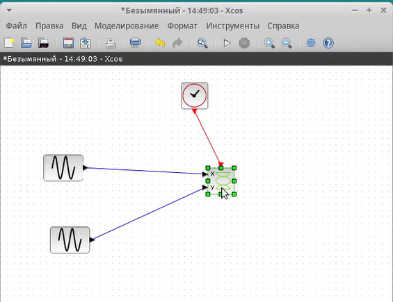{ #fig:pic1 width=100% }

## Этапы выполнения работы

1) A = B = 1, a = 2, b = 2, δ = 0; π/4; π/2; 3π/4; π; Устанавливаю параметры для блоков(рис.2).

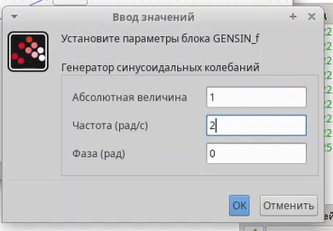{ #fig:pic2 width=100% }

## Этапы выполнения работы

Ввожу необходимые значения(рис.3).

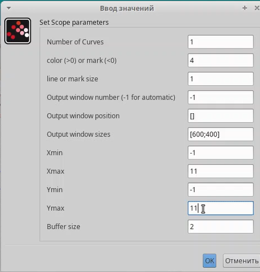{ #fig:pic3 width=100% }

## Этапы выполнения работы

Запускаю программу(рис.4).

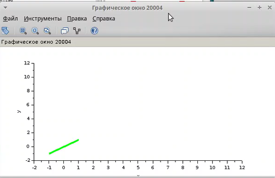{ #fig:pic4 width=100% }

## Этапы выполнения работы

Меняю фазу источника(рис.5).

{ #fig:pic5 width=100% }

## Этапы выполнения работы

Запускаю программу(рис.6).

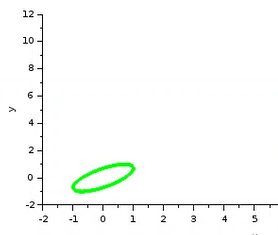{ #fig:pic6 width=100% }

## Этапы выполнения работы

Меняю фазу источника(рис.7).

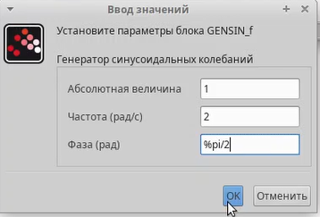{ #fig:pic7 width=100% }

## Этапы выполнения работы

Запускаю программу(рис.8).

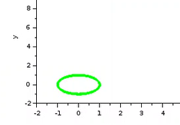{ #fig:pic8 width=100% }

## Этапы выполнения работы

Меняю фазу источника(рис.9).

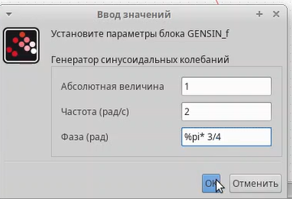{ #fig:pic9 width=100% }

## Этапы выполнения работы

Запускаю программу(рис.10).

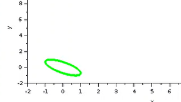{ #fig:pic10 width=100% }

## Этапы выполнения работы

Меняю фазу источника(рис.11).

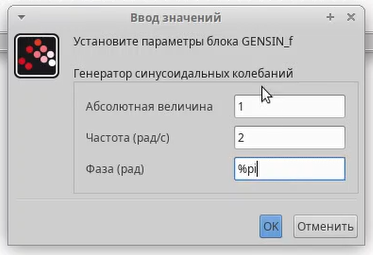{ #fig:pic11 width=100% }

## Этапы выполнения работы

Запускаю программу(рис.12).

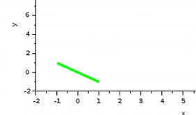{ #fig:pic12 width=100% }

## Этапы выполнения работы

2) A = B = 1, a = 2, b = 4, δ = 0; π/4; π/2; 3π/4; π; Меняю параметр блока(рис.13).

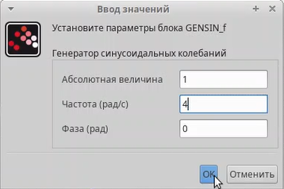{ #fig:pic13 width=100% }

## Этапы выполнения работы

Запускаю программу(рис.14).

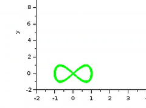{ #fig:pic14 width=100% }

## Этапы выполнения работы

Меняю фазу источника. Запускаю программу(рис.15).

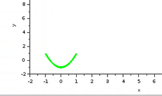{ #fig:pic15 width=100% }

## Этапы выполнения работы

Меняю фазу источника. Запускаю программу(рис.16).

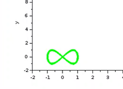{ #fig:pic16 width=100% }

## Этапы выполнения работы

Меняю фазу источника. Запускаю программу(рис.17).

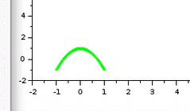{ #fig:pic17 width=100% }

## Этапы выполнения работы

Меняю фазу источника. Запускаю программу(рис.18).

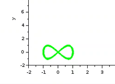{ #fig:pic18 width=100% }

## Этапы выполнения работы

3) A = B = 1, a = 2, b = 6, δ = 0; π/4; π/2; 3π/4; π; Меняю параметр блока(рис.19).

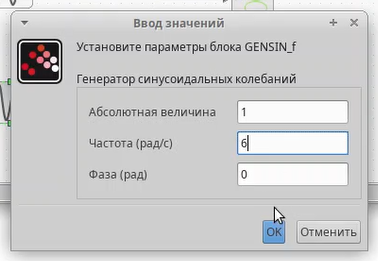{ #fig:pic19 width=100% }

## Этапы выполнения работы

Запускаю программу(рис.20).

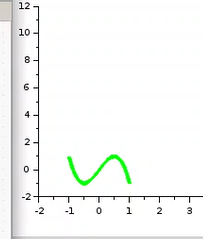{ #fig:pic20 width=100% }

## Этапы выполнения работы

Меняю фазу источника. Запускаю программу(рис.21).

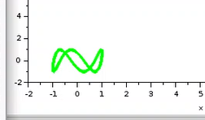{ #fig:pic21 width=100% }

## Этапы выполнения работы

Меняю фазу источника. Запускаю программу(рис.22).

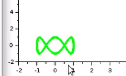{ #fig:pic22 width=100% }

## Этапы выполнения работы

Меняю фазу источника. Запускаю программу(рис.23).

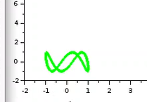{ #fig:pic23 width=100% }

## Этапы выполнения работы

Меняю фазу источника. Запускаю программу(рис.24).

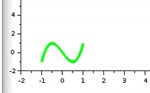{ #fig:pic24 width=100% }

## Этапы выполнения работы

4) A = B = 1, a = 2, b = 3, δ = 0; π/4; π/2; 3π/4; π. Меняю параметр блока(рис.25).

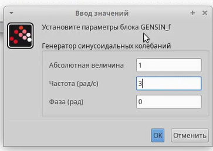{ #fig:pic25 width=100% }

## Этапы выполнения работы

Запускаю программу(рис.26).

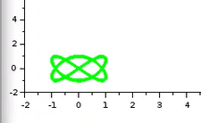{ #fig:pic26 width=100% }

## Этапы выполнения работы

Меняю фазу источника. Запускаю программу(рис.27).

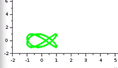{ #fig:pic27 width=100% }

## Этапы выполнения работы

Меняю фазу источника. Запускаю программу(рис.28).

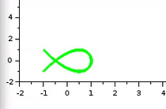{ #fig:pic28 width=100% }

## Этапы выполнения работы

Меняю фазу источника. Запускаю программу(рис.29).

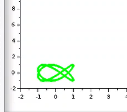{ #fig:pic29 width=100% }

## Этапы выполнения работы

Меняю фазу источника. Запускаю программу(рис.30).

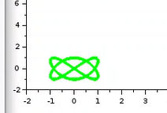{ #fig:pic30 width=100% }

## Выводы

Ознакомилась с Scilab, подсистемой xcos. Выполнила упражнение.

