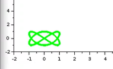

---
## Front matter
title: "Упражнение"
subtitle: "Дисциплина: Имитационное моделирование"
author: "Пронякова Ольга Максимовна"

## Generic otions
lang: ru-RU
toc-title: "Содержание"

## Bibliography
bibliography: bib/cite.bib
csl: pandoc/csl/gost-r-7-0-5-2008-numeric.csl

## Pdf output format
toc: true # Table of contents
toc-depth: 2
lof: true # List of figures
lot: true # List of tables
fontsize: 12pt
linestretch: 1.5
papersize: a4
documentclass: scrreprt
## I18n polyglossia
polyglossia-lang:
  name: russian
  options:
	- spelling=modern
	- babelshorthands=true
polyglossia-otherlangs:
  name: english
## I18n babel
babel-lang: russian
babel-otherlangs: english
## Fonts
mainfont: IBM Plex Serif
romanfont: IBM Plex Serif
sansfont: IBM Plex Sans
monofont: IBM Plex Mono
mathfont: STIX Two Math
mainfontoptions: Ligatures=Common,Ligatures=TeX,Scale=0.94
romanfontoptions: Ligatures=Common,Ligatures=TeX,Scale=0.94
sansfontoptions: Ligatures=Common,Ligatures=TeX,Scale=MatchLowercase,Scale=0.94
monofontoptions: Scale=MatchLowercase,Scale=0.94,FakeStretch=0.9
mathfontoptions:
## Biblatex
biblatex: true
biblio-style: "gost-numeric"
biblatexoptions:
  - parentracker=true
  - backend=biber
  - hyperref=auto
  - language=auto
  - autolang=other*
  - citestyle=gost-numeric
## Pandoc-crossref LaTeX customization
figureTitle: "Рис."
tableTitle: "Таблица"
listingTitle: "Листинг"
lofTitle: "Список иллюстраций"
lotTitle: "Список таблиц"
lolTitle: "Листинги"
## Misc options
indent: true
header-includes:
  - \usepackage{indentfirst}
  - \usepackage{float} # keep figures where there are in the text
  - \floatplacement{figure}{H} # keep figures where there are in the text
---

# Цель работы

Ознакомиться с Scilab, подсистемой xcos. Выполнить упражнение.

# Теоретические сведения

Scilab — система компьютерной математики, предназначенная для решения вычислительных задач.
Программа xcos является приложением к пакету Scilab.

# Выполнение лабораторной работы

Создаю моlель в xcos(рис.[-@fig:pic1]).

{ #fig:pic1 width=100% }

1) A = B = 1, a = 2, b = 2, δ = 0; π/4; π/2; 3π/4; π; Устанавливаю параметры для блоков(рис.[-@fig:pic2]).

{ #fig:pic2 width=100% }

Ввожу необходимые значения(рис.[-@fig:pic3]).

{ #fig:pic3 width=100% }

Запускаю программу(рис.[-@fig:pic4]).

{ #fig:pic4 width=100% }

Меняю фазу источника(рис.[-@fig:pic5]).

{ #fig:pic5 width=100% }

Запускаю программу(рис.[-@fig:pic6]).

{ #fig:pic6 width=100% }

Меняю фазу источника(рис.[-@fig:pic7]).

{ #fig:pic7 width=100% }

Запускаю программу(рис.[-@fig:pic8]).

{ #fig:pic8 width=100% }

Меняю фазу источника(рис.[-@fig:pic9]).

{ #fig:pic9 width=100% }

Запускаю программу(рис.[-@fig:pic10]).

{ #fig:pic10 width=100% }

Меняю фазу источника(рис.[-@fig:pic11]).

{ #fig:pic11 width=100% }

Запускаю программу(рис.[-@fig:pic12]).

{ #fig:pic12 width=100% }

2) A = B = 1, a = 2, b = 4, δ = 0; π/4; π/2; 3π/4; π; Меняю параметр блока(рис.[-@fig:pic13]).

{ #fig:pic13 width=100% }

Запускаю программу(рис.[-@fig:pic14]).

{ #fig:pic14 width=100% }

Меняю фазу источника. Запускаю программу(рис.[-@fig:pic15]).

{ #fig:pic15 width=100% }

Меняю фазу источника. Запускаю программу(рис.[-@fig:pic16]).

{ #fig:pic16 width=100% }

Меняю фазу источника. Запускаю программу(рис.[-@fig:pic17]).

{ #fig:pic17 width=100% }

Меняю фазу источника. Запускаю программу(рис.[-@fig:pic18]).

{ #fig:pic18 width=100% }

3) A = B = 1, a = 2, b = 6, δ = 0; π/4; π/2; 3π/4; π; Меняю параметр блока(рис.[-@fig:pic19]).

{ #fig:pic19 width=100% }

Запускаю программу(рис.[-@fig:pic20]).

{ #fig:pic20 width=100% }

Меняю фазу источника. Запускаю программу(рис.[-@fig:pic21]).

{ #fig:pic21 width=100% }

Меняю фазу источника. Запускаю программу(рис.[-@fig:pic22]).

{ #fig:pic22 width=100% }

Меняю фазу источника. Запускаю программу(рис.[-@fig:pic23]).

{ #fig:pic23 width=100% }

Меняю фазу источника. Запускаю программу(рис.[-@fig:pic24]).

{ #fig:pic24 width=100% }

4) A = B = 1, a = 2, b = 3, δ = 0; π/4; π/2; 3π/4; π. Меняю параметр блока(рис.[-@fig:pic25]).

{ #fig:pic25 width=100% }

Запускаю программу(рис.[-@fig:pic26]).

{ #fig:pic26 width=100% }

Меняю фазу источника. Запускаю программу(рис.[-@fig:pic27]).

{ #fig:pic27 width=100% }

Меняю фазу источника. Запускаю программу(рис.[-@fig:pic28]).

{ #fig:pic28 width=100% }

Меняю фазу источника. Запускаю программу(рис.[-@fig:pic29]).

{ #fig:pic29 width=100% }

Меняю фазу источника. Запускаю программу(рис.[-@fig:pic30]).

{ #fig:pic30 width=100% }

# Выводы

Ознакомилась с Scilab, подсистемой xcos. Выполнила упражнение.

# Список литературы{.unnumbered}

::: {#refs}
:::
