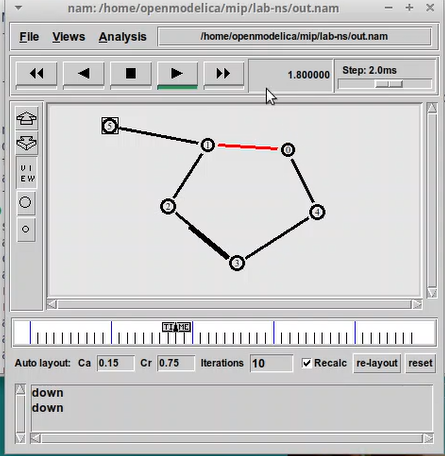

---
## Front matter
lang: ru-RU
title: Лабораторная работа №1
subtitle: Дисциплина - имитационное моделирование
author:
  - Пронякова О.М.
institute:
  - Российский университет дружбы народов, Москва, Россия
date: 16 февраля 2024

## i18n babel
babel-lang: russian
babel-otherlangs: english

## Formatting pdf
toc: false
toc-title: Содержание
slide_level: 2
aspectratio: 169
section-titles: true
theme: metropolis
header-includes:
 - \metroset{progressbar=frametitle,sectionpage=progressbar,numbering=fraction}
---

# Информация

## Докладчик

:::::::::::::: {.columns align=center}
::: {.column width="70%"}

  * Пронякова Ольга Максимовна
  * студент НКАбд-02-22
  * факультет физико-математических и естественных наук
  * Российский университет дружбы народов

:::
::::::::::::::

# Создание презентации

## Цель работы

Приобретение навыков моделирования сетей передачи данных с помощью средства имитационного моделирования NS-2, а также анализ полученных результатов моделирования.

## Задание

1. Шаблон сценария для NS-2
2. Простой пример описания топологии сети, состоящей из двух узлов и одного соединения
3. Пример с усложнённой топологией сети
4. Пример с кольцевой топологией сети
5. Упражнение 

## Этапы выполнения работы

В своём рабочем каталоге создаю директорию mip, в которой будут выполняться лабораторные работы. Внутри mip создаю директорию lab-ns, а в ней файл shablon.tcl. Откываюна редактирование файла shablon.tcl и заполняю его по инструкции(рис.1).

## Этапы выполнения работы

{ #fig:pic1 width=100% }

## Этапы выполнения работы

Нужноо смоделировать сеть передачи данных, состоящую из двух узлов, соединённых дуплексной линией связи с полосой пропускания 2 Мб/с и задержкой 10 мс, очередью с обслуживанием типа DropTail. От одного узла к другому по протоколу UDP осуществляется передача пакетов, размером 500 байт, с постоянной скоростью 200 пакетов в секунду. 
Копирую содержимое предыдущего файла в новый и заполняю по образцу(рис.2), (рис.3).

## Этапы выполнения работы

{ #fig:pic2 width=100% }

## Этапы выполнения работы

{ #fig:pic3 width=100% }

## Этапы выполнения работы

- сеть состоит из 4 узлов
- между узлами n0 и n2, n1 и n2 установлено дуплексное соединение с пропускной
способностью 2 Мбит/с и задержкой 10 мс;
- между узлами n2 и n3 установлено дуплексное соединение с пропускной способ-
ностью 1,7 Мбит/с и задержкой 20 мс;
- каждый узел использует очередь с дисциплиной DropTail для накопления пакетов,
максимальный размер которой составляет 10;
- TCP-источник на узле n0 подключается к TCP-приёмнику на узле n3
(по-умолчанию, максимальный размер пакета, который TCP-агент может генери-
ровать, равняется 1KByte)
- TCP-приёмник генерирует и отправляет ACK пакеты отправителю и откидывает
полученные пакеты;
- UDP-агент, который подсоединён к узлу n1, подключён к null-агенту на узле n3
(null-агент просто откидывает пакеты);
- генераторы трафика ftp и cbr прикреплены к TCP и UDP агентам соответственно;
- генератор cbr генерирует пакеты размером 1 Кбайт со скоростью 1 Мбит/с;
- работа cbr начинается в 0,1 секунду и прекращается в 4,5 секунды, а ftp начинает
работать в 1,0 секунду и прекращает в 4,0 секунды

Копирую содержимое предыдущего файла в новый и заполняю по образцу(рис.4), (рис.5).

## Этапы выполнения работы

{ #fig:pic4 width=100% }

## Этапы выполнения работы

{ #fig:pic5 width=100% }

## Этапы выполнения работы

Требуется построить модель передачи данных по сети с коль-
цевой топологией и динамической маршрутизацией пакетов:
- сеть состоит из 7 узлов, соединённых в кольцо;
- данные передаются от узла n(0) к узлу n(3) по кратчайшему пути;
- с 1 по 2 секунду модельного времени происходит разрыв соединения между узлами n(1) и n(2);
- при разрыве соединения маршрут передачи данных должен измениться на резервный

Копирую содержимое предыдущего файла в новый и заполняю по образцу(рис.6), (рис.7).

## Этапы выполнения работы

{ #fig:pic6 width=100% }

## Этапы выполнения работы

{ #fig:pic7 width=100% }

## Этапы выполнения работы

Внесите следующие изменения в реализацию примера с кольцевой топологией сети:

- передача данных должна осуществляться от узла n(0) до узла n(5) по кратчай-
шему пути в течение 5 секунд модельного времени;
- передача данных должна идти по протоколу TCP (тип Newreno), на принимаю-
щей стороне используется TCPSink-объект типа DelAck; поверх TCP работает
протокол FTP с 0,5 до 4,5 секунд модельного времени;
- с 1 по 2 секунду модельного времени происходит разрыв соединения между
узлами n(0) и n(1);
- при разрыве соединения маршрут передачи данных должен измениться на ре-
зервный, после восстановления соединения пакеты снова должны пойти по
кратчайшему пути.

Копирую содержимое предыдущего файла в новый и добавляю корректировки(рис.8, (рис.9).

## Этапы выполнения работы

{ #fig:pic8 width=100% }

## Этапы выполнения работы

{ #fig:pic9 width=100% }

## Выводы

Приобрела навыки моделирования сетей передачи данных с помощью средства имитационного моделирования NS-2, а также проанализировала полученные результаты моделирования.

