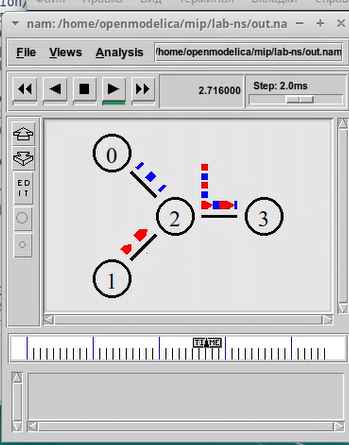

---
## Front matter
title: "Лабораторная работа №1"
subtitle: "Дисциплина: Имитационное моделирование"
author: "Пронякова Ольга Максимовна"

## Generic otions
lang: ru-RU
toc-title: "Содержание"

## Bibliography
bibliography: bib/cite.bib
csl: pandoc/csl/gost-r-7-0-5-2008-numeric.csl

## Pdf output format
toc: true # Table of contents
toc-depth: 2
lof: true # List of figures
lot: true # List of tables
fontsize: 12pt
linestretch: 1.5
papersize: a4
documentclass: scrreprt
## I18n polyglossia
polyglossia-lang:
  name: russian
  options:
	- spelling=modern
	- babelshorthands=true
polyglossia-otherlangs:
  name: english
## I18n babel
babel-lang: russian
babel-otherlangs: english
## Fonts
mainfont: IBM Plex Serif
romanfont: IBM Plex Serif
sansfont: IBM Plex Sans
monofont: IBM Plex Mono
mathfont: STIX Two Math
mainfontoptions: Ligatures=Common,Ligatures=TeX,Scale=0.94
romanfontoptions: Ligatures=Common,Ligatures=TeX,Scale=0.94
sansfontoptions: Ligatures=Common,Ligatures=TeX,Scale=MatchLowercase,Scale=0.94
monofontoptions: Scale=MatchLowercase,Scale=0.94,FakeStretch=0.9
mathfontoptions:
## Biblatex
biblatex: true
biblio-style: "gost-numeric"
biblatexoptions:
  - parentracker=true
  - backend=biber
  - hyperref=auto
  - language=auto
  - autolang=other*
  - citestyle=gost-numeric
## Pandoc-crossref LaTeX customization
figureTitle: "Рис."
tableTitle: "Таблица"
listingTitle: "Листинг"
lofTitle: "Список иллюстраций"
lotTitle: "Список таблиц"
lolTitle: "Листинги"
## Misc options
indent: true
header-includes:
  - \usepackage{indentfirst}
  - \usepackage{float} # keep figures where there are in the text
  - \floatplacement{figure}{H} # keep figures where there are in the text
---

# Цель работы

Приобретение навыков моделирования сетей передачи данных с помощью средства имитационного моделирования NS-2, а также анализ полученных результатов моделирования.

# Задание

1. Шаблон сценария для NS-2
2. Простой пример описания топологии сети, состоящей из двух узлов и одного соединения
3. Пример с усложнённой топологией сети
4. Пример с кольцевой топологией сети
5. Упражнение 

# Выполнение лабораторной работы

В своём рабочем каталоге создаю директорию mip, в которой будут выполняться лабораторные работы. Внутри mip создаю директорию lab-ns, а в ней файл shablon.tcl. Откываюна редактирование файла shablon.tcl и заполняю его по инструкции(рис.[-@fig:pic1]).

{ #fig:pic1 width=100% }

Нужноо смоделировать сеть передачи данных, состоящую из двух узлов, соединённых дуплексной линией связи с полосой пропускания 2 Мб/с и задержкой 10 мс, очередью с обслуживанием типа DropTail. От одного узла к другому по протоколу UDP осуществляется передача пакетов, размером 500 байт, с постоянной скоростью 200 пакетов в секунду. 
Копирую содержимое предыдущего файла в новый и заполняю по образцу(рис.[-@fig:pic2]), (рис.[-@fig:pic3]).

{ #fig:pic2 width=100% }

{ #fig:pic3 width=100% }

- сеть состоит из 4 узлов
- между узлами n0 и n2, n1 и n2 установлено дуплексное соединение с пропускной
способностью 2 Мбит/с и задержкой 10 мс;
- между узлами n2 и n3 установлено дуплексное соединение с пропускной способ-
ностью 1,7 Мбит/с и задержкой 20 мс;
- каждый узел использует очередь с дисциплиной DropTail для накопления пакетов,
максимальный размер которой составляет 10;
- TCP-источник на узле n0 подключается к TCP-приёмнику на узле n3
(по-умолчанию, максимальный размер пакета, который TCP-агент может генери-
ровать, равняется 1KByte)
- TCP-приёмник генерирует и отправляет ACK пакеты отправителю и откидывает
полученные пакеты;
- UDP-агент, который подсоединён к узлу n1, подключён к null-агенту на узле n3
(null-агент просто откидывает пакеты);
- генераторы трафика ftp и cbr прикреплены к TCP и UDP агентам соответственно;
- генератор cbr генерирует пакеты размером 1 Кбайт со скоростью 1 Мбит/с;
- работа cbr начинается в 0,1 секунду и прекращается в 4,5 секунды, а ftp начинает
работать в 1,0 секунду и прекращает в 4,0 секунды

Копирую содержимое предыдущего файла в новый и заполняю по образцу(рис.[-@fig:pic4]), (рис.[-@fig:pic5]).

{ #fig:pic4 width=100% }

{ #fig:pic5 width=100% }

Требуется построить модель передачи данных по сети с коль-
цевой топологией и динамической маршрутизацией пакетов:
- сеть состоит из 7 узлов, соединённых в кольцо;
- данные передаются от узла n(0) к узлу n(3) по кратчайшему пути;
- с 1 по 2 секунду модельного времени происходит разрыв соединения между узлами n(1) и n(2);
- при разрыве соединения маршрут передачи данных должен измениться на резервный

Копирую содержимое предыдущего файла в новый и заполняю по образцу(рис.[-@fig:pic6]), (рис.[-@fig:pic7]).

{ #fig:pic6 width=100% }

{ #fig:pic7 width=100% }

Внесите следующие изменения в реализацию примера с кольцевой топологией сети:

- передача данных должна осуществляться от узла n(0) до узла n(5) по кратчай-
шему пути в течение 5 секунд модельного времени;
- передача данных должна идти по протоколу TCP (тип Newreno), на принимаю-
щей стороне используется TCPSink-объект типа DelAck; поверх TCP работает
протокол FTP с 0,5 до 4,5 секунд модельного времени;
- с 1 по 2 секунду модельного времени происходит разрыв соединения между
узлами n(0) и n(1);
- при разрыве соединения маршрут передачи данных должен измениться на ре-
зервный, после восстановления соединения пакеты снова должны пойти по
кратчайшему пути.

Копирую содержимое предыдущего файла в новый и добавляю корректировки(рис.[-@fig:pic8]), (рис.[-@fig:pic9]).

{ #fig:pic8 width=100% }

{ #fig:pic9 width=100% }

# Выводы

Приобрела навыки моделирования сетей передачи данных с помощью средства имитационного моделирования NS-2, а также проанализировала полученные результаты моделирования.

# Список литературы{.unnumbered}

::: {#refs}
:::
