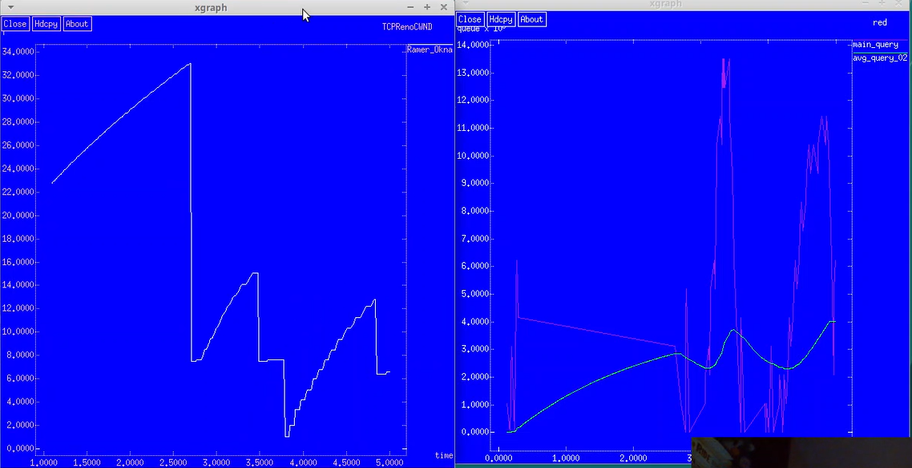
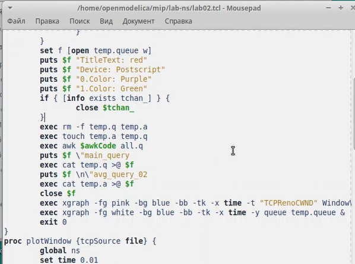
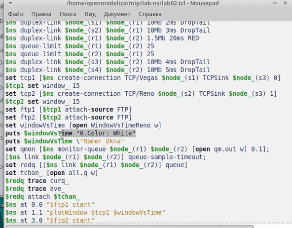
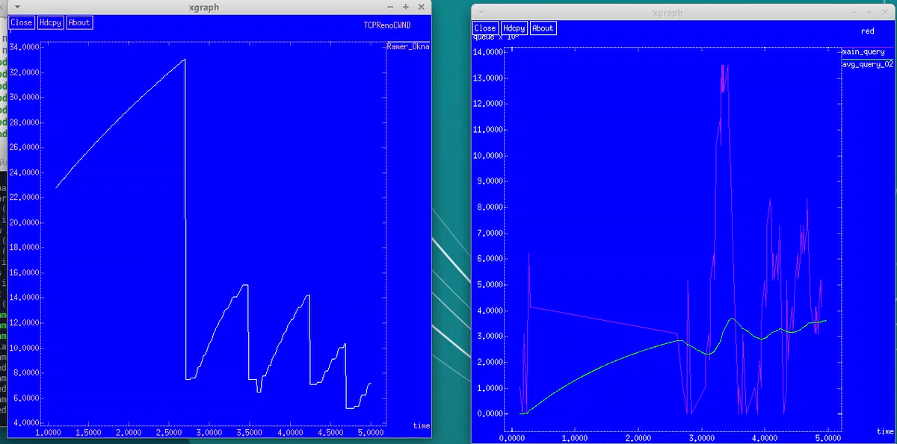
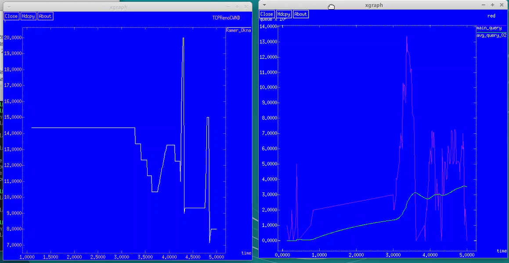

---
## Front matter
lang: ru-RU
title: Лабораторная работа №1
subtitle: Дисциплина - имитационное моделирование
author:
  - Пронякова О.М.
institute:
  - Российский университет дружбы народов, Москва, Россия
date: 18 февраля 2025

## i18n babel
babel-lang: russian
babel-otherlangs: english

## Formatting pdf
toc: false
toc-title: Содержание
slide_level: 2
aspectratio: 169
section-titles: true
theme: metropolis
header-includes:
 - \metroset{progressbar=frametitle,sectionpage=progressbar,numbering=fraction}
---

# Информация

## Докладчик

:::::::::::::: {.columns align=center}
::: {.column width="70%"}

  * Пронякова Ольга Максимовна
  * студент НКАбд-02-22
  * факультет физико-математических и естественных наук
  * Российский университет дружбы народов

:::
::::::::::::::

# Создание презентации

## Цель работы

Исследовать протокол TCP и алгоритм управления очередью RED.

## Задание

- Измените в модели на узле s1 тип протокола TCP с Reno на NewReno, затем на Vegas. Сравните и поясните результаты.
- Внесите изменения при отображении окон с графиками (измените цвет фона, цвет траекторий, подписи к осям, подпись траектории в легенде).

## Этапы выполнения работы

ребуется разработать сценарий, реализующий модель согласно рис. 2.4, по-
строить в Xgraph график изменения TCP-окна, график изменения длины очереди
и средней длины очереди. Использую код из инструкции(рис.1).

{ #fig:pic1 width=100% }

## Этапы выполнения работы

Изменила в модели на узле s1 тип протокола TCP с Reno на NewReno, затем на
Vegas. После сравнения результатов получила. что тип протокола TCP Reno и NewReno похожи между собой, перезагрузка происходит после того, как потерялись некоторые пакеты. у типа Vegas перезагрузка происходит перед тем. как потеряются пакеты. Далее внесла изменения при отображении окон с графиками (изменила цвет фона, цвет траекторий, подписи к осям, подпись траектории в легенде)(рис.4), (рис.5), (рис.2), (рис.3).

## Этапы выполнения работы

{ #fig:pic4 width=100% }

## Этапы выполнения работы

{ #fig:pic5 width=100% }

## Этапы выполнения работы

{ #fig:pic2 width=100% }

## Этапы выполнения работы

{ #fig:pic3 width=100% }

## Выводы

Исследовала протокол TCP и алгоритм управления очередью RED.
