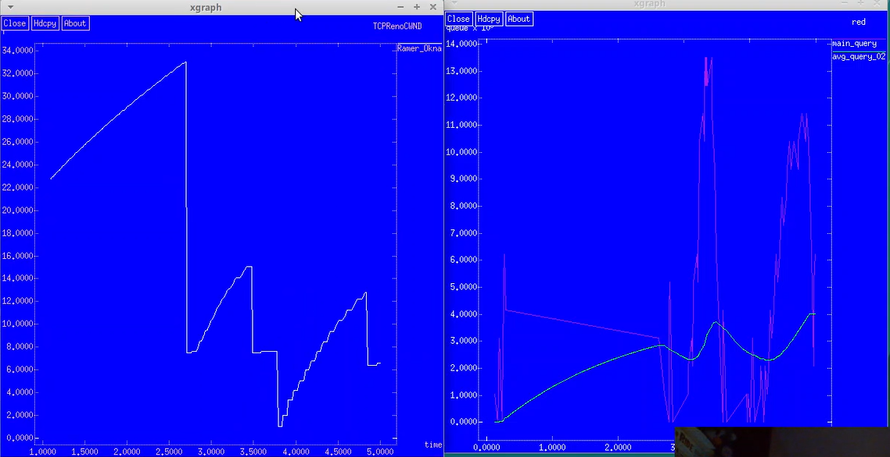
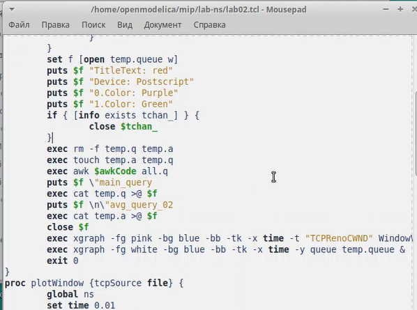
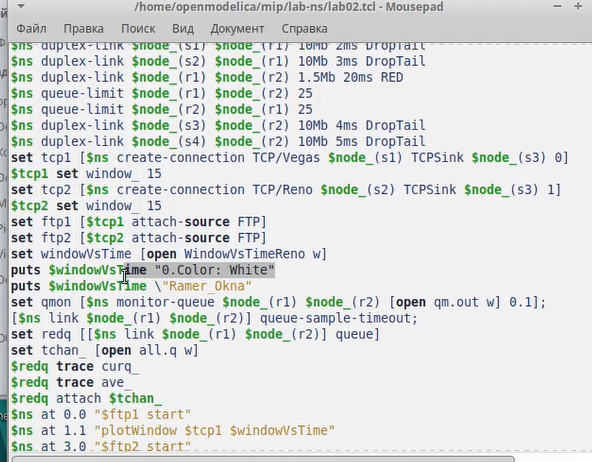
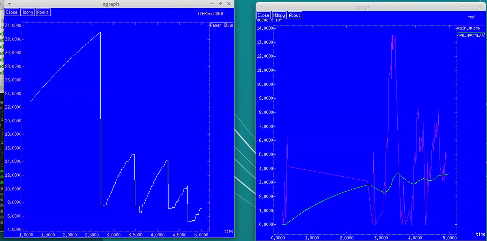
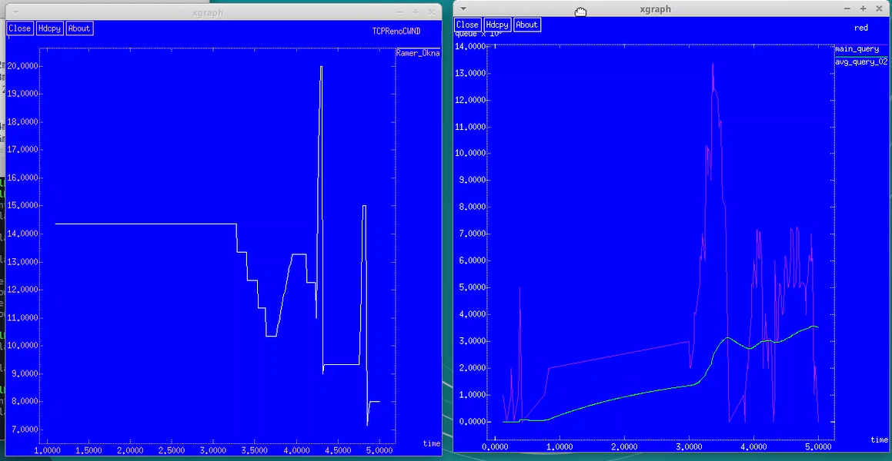

---
## Front matter
title: "Лабораторная работа №2"
subtitle: "Дисциплина: Имитационное моделирование"
author: "Пронякова Ольга Максимовна"

## Generic otions
lang: ru-RU
toc-title: "Содержание"

## Bibliography
bibliography: bib/cite.bib
csl: pandoc/csl/gost-r-7-0-5-2008-numeric.csl

## Pdf output format
toc: true # Table of contents
toc-depth: 2
lof: true # List of figures
lot: true # List of tables
fontsize: 12pt
linestretch: 1.5
papersize: a4
documentclass: scrreprt
## I18n polyglossia
polyglossia-lang:
  name: russian
  options:
	- spelling=modern
	- babelshorthands=true
polyglossia-otherlangs:
  name: english
## I18n babel
babel-lang: russian
babel-otherlangs: english
## Fonts
mainfont: IBM Plex Serif
romanfont: IBM Plex Serif
sansfont: IBM Plex Sans
monofont: IBM Plex Mono
mathfont: STIX Two Math
mainfontoptions: Ligatures=Common,Ligatures=TeX,Scale=0.94
romanfontoptions: Ligatures=Common,Ligatures=TeX,Scale=0.94
sansfontoptions: Ligatures=Common,Ligatures=TeX,Scale=MatchLowercase,Scale=0.94
monofontoptions: Scale=MatchLowercase,Scale=0.94,FakeStretch=0.9
mathfontoptions:
## Biblatex
biblatex: true
biblio-style: "gost-numeric"
biblatexoptions:
  - parentracker=true
  - backend=biber
  - hyperref=auto
  - language=auto
  - autolang=other*
  - citestyle=gost-numeric
## Pandoc-crossref LaTeX customization
figureTitle: "Рис."
tableTitle: "Таблица"
listingTitle: "Листинг"
lofTitle: "Список иллюстраций"
lotTitle: "Список таблиц"
lolTitle: "Листинги"
## Misc options
indent: true
header-includes:
  - \usepackage{indentfirst}
  - \usepackage{float} # keep figures where there are in the text
  - \floatplacement{figure}{H} # keep figures where there are in the text
---

# Цель работы

Исследовать протокол TCP и алгоритм управления очередью RED.

# Задание

- Измените в модели на узле s1 тип протокола TCP с Reno на NewReno, затем на Vegas. Сравните и поясните результаты.
- Внесите изменения при отображении окон с графиками (измените цвет фона, цвет траекторий, подписи к осям, подпись траектории в легенде).

# Выполнение лабораторной работы

Требуется разработать сценарий, реализующий модель согласно рис. 2.4, по-
строить в Xgraph график изменения TCP-окна, график изменения длины очереди
и средней длины очереди. Использую код из инструкции(рис.[-@fig:pic1]).

{ #fig:pic1 width=100% }

Изменила в модели на узле s1 тип протокола TCP с Reno на NewReno, затем на
Vegas. После сравнения результатов получила. что тип протокола TCP Reno и NewReno похожи между собой, перезагрузка происходит после того, как потерялись некоторые пакеты. у типа Vegas перезагрузка происходит перед тем. как потеряются пакеты. Далее внесла изменения при отображении окон с графиками (изменила цвет фона, цвет траекторий, подписи к осям, подпись траектории в легенде)(рис.[-@fig:pic4]), (рис.[-@fig:pic5]), (рис.[-@fig:pic2]), (рис.[-@fig:pic3]).

{ #fig:pic4 width=100% }

{ #fig:pic5 width=100% }

{ #fig:pic2 width=100% }

{ #fig:pic3 width=100% }

# Выводы

Исследовала протокол TCP и алгоритм управления очередью RED.

# Список литературы{.unnumbered}

::: {#refs}
:::
