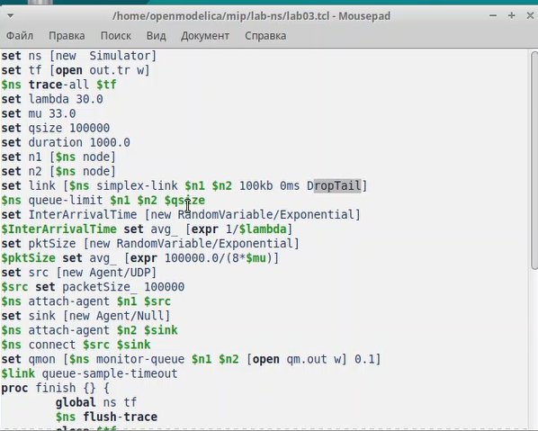

---
## Front matter
lang: ru-RU
title: Лабораторная работа №1
subtitle: Дисциплина - имитационное моделирование
author:
  - Пронякова О.М.
institute:
  - Российский университет дружбы народов, Москва, Россия
date: 19 февраля 2025

## i18n babel
babel-lang: russian
babel-otherlangs: english

## Formatting pdf
toc: false
toc-title: Содержание
slide_level: 2
aspectratio: 169
section-titles: true
theme: metropolis
header-includes:
 - \metroset{progressbar=frametitle,sectionpage=progressbar,numbering=fraction}
---

# Информация

## Докладчик

:::::::::::::: {.columns align=center}
::: {.column width="70%"}

  * Пронякова Ольга Максимовна
  * студент НКАбд-02-22
  * факультет физико-математических и естественных наук
  * Российский университет дружбы народов

:::
::::::::::::::

# Создание презентации

## Цель работы

Провести моделирование системы массового обслуживания.

## Задание

Реализация модели на NS-2

График в GNUplot

## Этапы выполнения работы

Реализация модели на NS-2рис. выполнение кода из инструкции([-@fig:pic1]), ([-@fig:pic2]).

{ #fig:pic1 width=100% }

## Этапы выполнения работы

{ #fig:pic2 width=100% }

## Этапы выполнения работы

В каталоге с проектом создаю отдельный файл graph_plot:
touch graph_plot
Открываю его на редактирование и добавляю следующий код, обращая внимание
на синтаксис GNUplot([-@fig:pic3]).

{ #fig:pic3 width=100% }

## Этапы выполнения работы

Сделала файл исполняемым. После компиляции файла с проектом, запускаю скрипт в созданном файле graph_plot, который создаст файл qm.pdf с результатами моделирования([-@fig:pic4]), ([-@fig:pic5]).

{ #fig:pic4 width=100% }

## Этапы выполнения работы

{ #fig:pic5 width=100% }

## Выводы

Провела моделирование системы массового обслуживания.

