c---
## Front matter
lang: ru-RU
title: Лабораторная работа №4
subtitle: Дисциплина - имитационное моделирование
author:
  - Пронякова О.М.
institute:
  - Российский университет дружбы народов, Москва, Россия
date: 19 февраля 2025
## i18n babel
babel-lang: russian
babel-otherlangs: english

## Formatting pdf
toc: false
toc-title: Содержание
slide_level: 2
aspectratio: 169
section-titles: true
theme: metropolis
header-includes:
 - \metroset{progressbar=frametitle,sectionpage=progressbar,numbering=fraction}
---

# Информация

## Докладчик

:::::::::::::: {.columns align=center}
::: {.column width="70%"}

  * Пронякова Ольга Максимовна
  * студент НКАбд-02-22
  * факультет физико-математических и естественных наук
  * Российский университет дружбы народов

:::
::::::::::::::

# Создание презентации

## Цель работы

Самостоятельно выполнить задания из лабораторной работы.

## Задание

– сеть состоит из N TCP-источников, N TCP-приёмников, двух маршрутизаторов
R1 и R2 между источниками и приёмниками (N — не менее 20);
– между TCP-источниками и первым маршрутизатором установлены дуплексные
соединения с пропускной способностью 100 Мбит/с и задержкой 20 мс очередью
типа DropTail;
– между TCP-приёмниками и вторым маршрутизатором установлены дуплексные
соединения с пропускной способностью 100 Мбит/с и задержкой 20 мс очередью
типа DropTail;
– между маршрутизаторами установлено симплексное соединение (R1–R2) с про-
пускной способностью 20 Мбит/с и задержкой 15 мс очередью типа RED,
размером буфера 300 пакетов; в обратную сторону — симплексное соедине-
ние (R2–R1) с пропускной способностью 15 Мбит/с и задержкой 20 мс очередью
типа DropTail;
– данные передаются по протоколу FTP поверх TCPReno;
– параметры алгоритма RED: qmin = 75, qmax = 150, qw = 0, 002, pmax = 0.1;
– максимальный размер TCP-окна 32; размер передаваемого пакета 500 байт; время
моделирования — не менее 20 единиц модельного времени.

## Этапы выполнения работы

Создаю файл lab04.tcl. Пишу код для выполнения задания(рис.1), (рис.2).

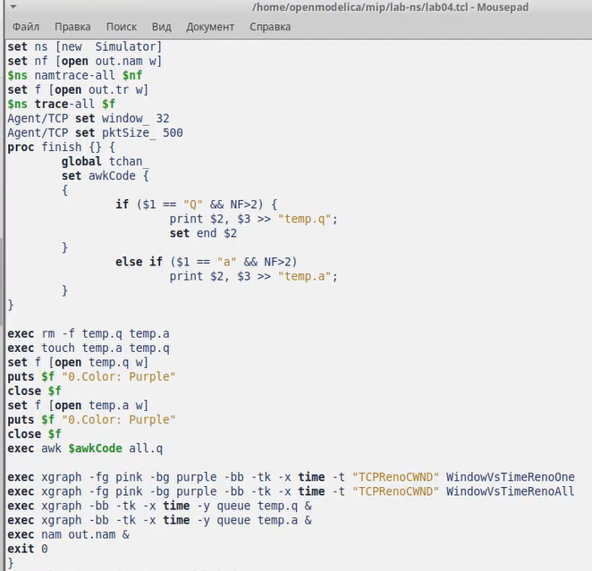{ #fig:pic1 width=100% }

## Этапы выполнения работы

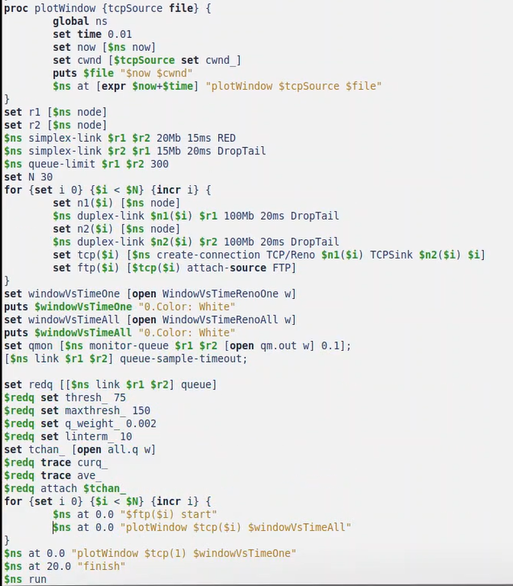{ #fig:pic2 width=100% }

## Этапы выполнения работы

Получились следующие графики(рис.3), (рис.4), (рис.5). (рис.6), (рис.7).

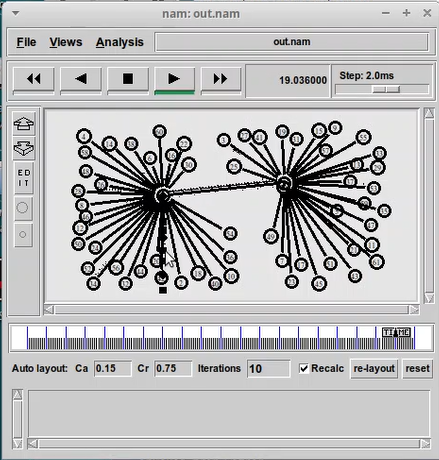{ #fig:pic3 width=100% }

## Этапы выполнения работы

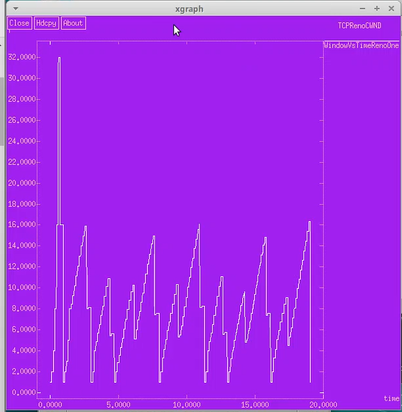{ #fig:pic4 width=100% }

## Этапы выполнения работы

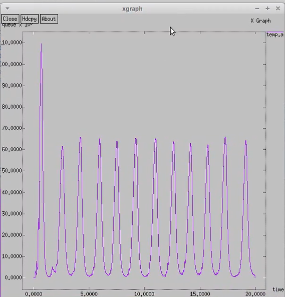{ #fig:pic5 width=100% }

## Этапы выполнения работы

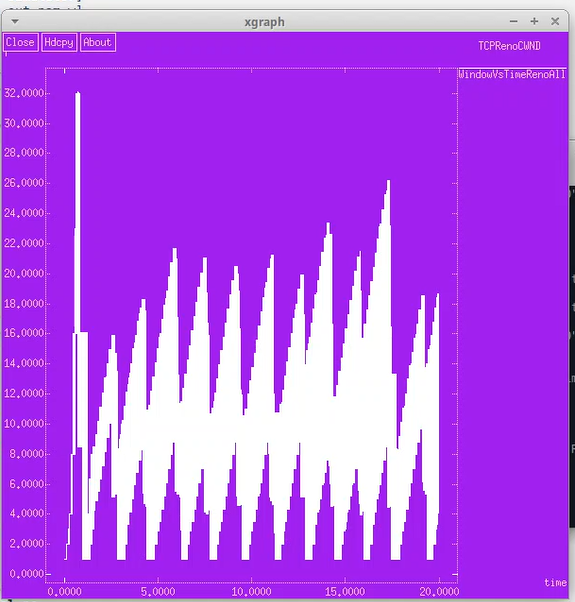{ #fig:pic6 width=100% }

## Этапы выполнения работы

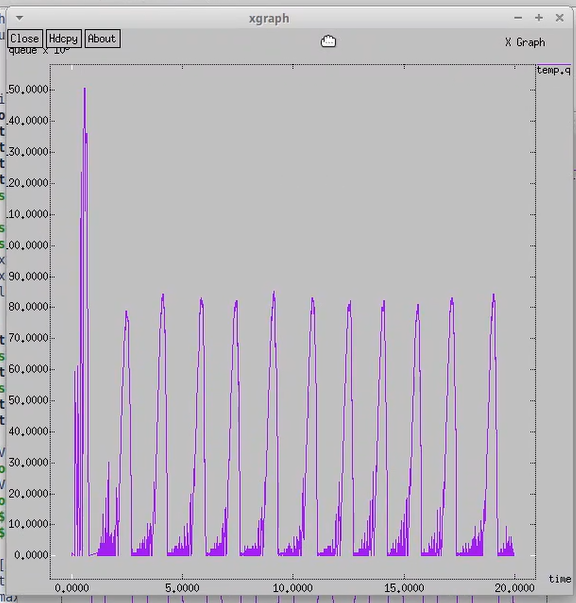{ #fig:pic7 width=100% }

## Этапы выполнения работы

Создаю файл graph_plot_lab04 и заполняю его(рис.8).

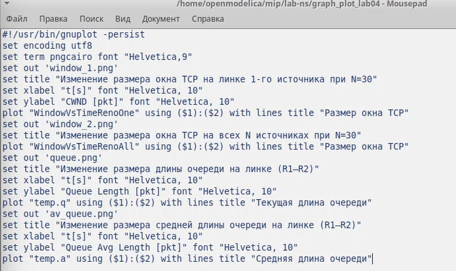{ #fig:pic8 width=100% }

## Этапы выполнения работы

Даю права файлу и запускаю его(рис.9).

{ #fig:pic9 width=100% }

## Этапы выполнения работы

Получились следующие графики(рис.10), (рис.11), (рис.12). (рис.13).

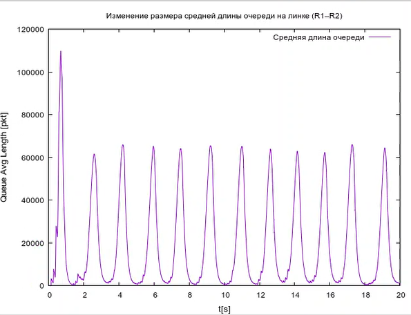{ #fig:pic10width=100% }

## Этапы выполнения работы

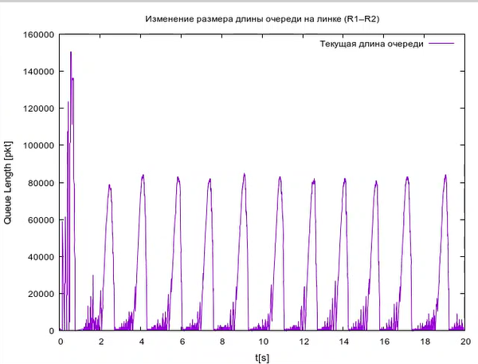{ #fig:pic11 width=100% }

## Этапы выполнения работы

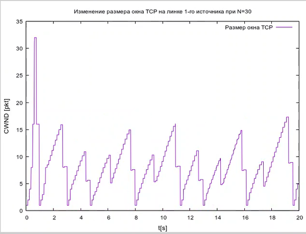{ #fig:pic12 width=100% }

## Этапы выполнения работы

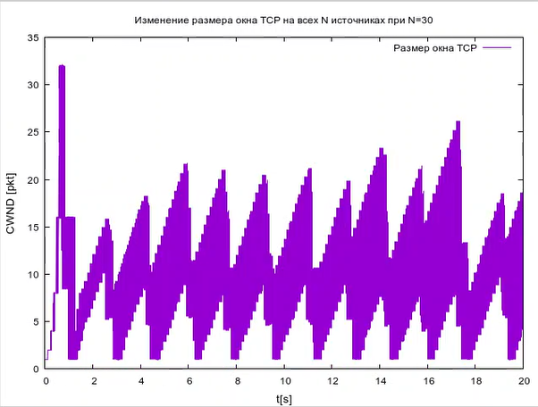{ #fig:pic13 width=100% }

## Выводы

Выполнила самостоятельную работу.

