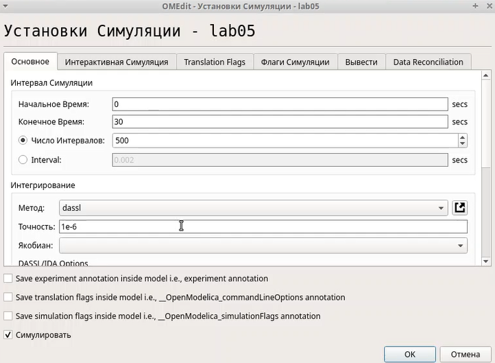

---
## Front matter
lang: ru-RU
title: Лабораторная работа №5
subtitle: Дисциплина - имитационное моделирование
author:
  - Пронякова О.М.
institute:
  - Российский университет дружбы народов, Москва, Россия
date: 04 марта 2025

## i18n babel
babel-lang: russian
babel-otherlangs: english

## Formatting pdf
toc: false
toc-title: Содержание
slide_level: 2
aspectratio: 169
section-titles: true
theme: metropolis
header-includes:
 - \metroset{progressbar=frametitle,sectionpage=progressbar,numbering=fraction}
---

# Информация

## Докладчик

:::::::::::::: {.columns align=center}
::: {.column width="70%"}

  * Пронякова Ольга Максимовна
  * студент НКАбд-02-22
  * факультет физико-математических и естественных наук
  * Российский университет дружбы народов

:::
::::::::::::::

# Создание презентации

## Цель работы

Ознакомиться с Моделью эпидемии (SIR). Выполнить задания на эту тему.

## Этапы выполнения работы

Модель SIR предложена в 1927 г. (W. O. Kermack, A. G. McKendrick). С описанием
модели можно ознакомиться, например в [1].
Предполагается, что особи популяции размера N могут находиться в трёх различ-
ных состояниях:
– S (susceptible, уязвимые) — здоровые особи, которые находятся в группе риска
и могут подхватить инфекцию;
– I (infective, заражённые, распространяющие заболевание) — заразившиеся пере-
носчики болезни;
– R (recovered/removed, вылечившиеся) — те, кто выздоровел и перестал распро-
странять болезнь (в эту категорию относят, например, приобретших иммунитет
или умерших).

Зафиксируем начальные данные: β = 1, ν = 0, 3, s(0) = 0, 999, i(0) = 0, 001, r(0) = 0. В меню Моделирование, Задать переменные окружения задаю значения переменных β и ν(рис.1).

## Этапы выполнения работы

{ #fig:pic1 width=100% }

## Этапы выполнения работы

Строю модель по аналогии с инструкцией(рис.2).

{ #fig:pic2 width=100% }

## Этапы выполнения работы

Выходы трёх блоков интегрирования соединяем с мультиплексором. В параметрах верхнего и среднего блока интегрирования задаю начальные значения s(0) = 0, 999 и i(0) = 0, 001(рис.3). (рис.4).

{ #fig:pic3 width=100% }

## Этапы выполнения работы

{ #fig:pic4 width=100% }

## Этапы выполнения работы

Изменяю параметры блока суммирования(рис.5).

{ #fig:pic5 width=100% }

## Этапы выполнения работы

изменяю параметры моделирования и ставлю конечное время интегрирования на 30(рис.6).

{ #fig:pic6 width=100% }

## Этапы выполнения работы

Результат прпограммы - график(рис.7).

{ #fig:pic7 width=100% }

## Этапы выполнения работы

Реализация модели с помощью блока Modelica в xcos.
Для реализации модели с помощью языка Modelica помимо блоков CLOCK_c, CSCOPE, TEXT_f и MUX требуются блоки CONST_m — задаёт константу; MBLOCK (Modelica generic) — блок реализации кода на языке Modelica. Задаём значения переменных β и ν. Переменные на входе (“beta”, “nu”) и выходе (“s”, “i”, “r”) блока заданы как внешние (“E”). реализую модель SIR в xcos с применением блока Modelica(рис.8).

## Этапы выполнения работы

{ #fig:pic8 width=100% }

## Этапы выполнения работы

Настраиваю Параметры блока Modelica для модели. Пишу Код на языке Modelica(рис.9), (рис.10).

{ #fig:pic9 width=100% }

## Этапы выполнения работы

{ #fig:pic10 width=100% }

## Этапы выполнения работы

Результат программы - график(рис.11).

{ #fig:pic11 width=100% }

## Этапы выполнения работы

Реализую модель SIR в OpenModelica(рис.12).

{ #fig:pic12 width=100% }

## Этапы выполнения работы

Изменяю параметры моделирования и ставлю конечное время интегрирования на 30(рис.13).

{ #fig:pic13 width=100% }

## Этапы выполнения работы

Результат прпограммы - график(рис.14).

{ #fig:pic14 width=100% }

## Этапы выполнения работы

Требуется:
– реализовать модель SIR с учётом процесса рождения / гибели особей в xcos (в
том числе и с использованием блока Modelica), а также в OpenModelica;
– построить графики эпидемического порога при различных значениях параметров
модели (в частности изменяя параметр μ);
– сделать анализ полученных графиков в зависимости от выбранных значений
параметров модели.

Зафиксируем начальные данные: β = 1, ν = 0, 3, mu = 0.1, s(0) = 0, 999, i(0) = 0, 001, r(0) = 0. В меню Моделирование, Задать переменные окружения задаю значения переменных β и ν. строю модель, подходящую под заданное уравнение(рис.15).

## Этапы выполнения работы

{ #fig:pic15 width=100% }

## Этапы выполнения работы

Результат прпограммы - график(рис.16).

{ #fig:pic16 width=100% }

## Этапы выполнения работы

Реализация модели с помощью блока Modelica в xcos.
Для реализации модели с помощью языка Modelica помимо блоков CLOCK_c, CSCOPE, TEXT_f и MUX требуются блоки CONST_m — задаёт константу; MBLOCK (Modelica generic) — блок реализации кода на языке Modelica. Задаём значения переменных β и ν. Переменные на входе (“beta”, “nu”. mu) и выходе (“s”, “i”, “r”) блока заданы как внешние (“E”). реализую модель SIR в xcos с применением блока Modelica(рис.17).

## Этапы выполнения работы

{ #fig:pic17 width=100% }

## Этапы выполнения работы

Настраиваю Параметры блока Modelica для модели. Пишу Код на языке Modelica(рис.18), (рис.19).

{ #fig:pic18 width=100% }

## Этапы выполнения работы

{ #fig:pic19 width=100% }

## Этапы выполнения работы

Результат прпограммы - график(рис.20).

{ #fig:pic20 width=100% }

## Этапы выполнения работы

Реализую модель SIR в OpenModelica. Изменяю параметры моделирования и ставлю конечное время интегрирования на 30(рис.21).

{ #fig:pic21 width=100% }

## Этапы выполнения работы

Результат прпограммы - график(рис.22).

{ #fig:pic22 width=100% }

## Выводы

Ознакомилась с Моделью эпидемии (SIR). Выполнила задания на эту тему.
