---
## Front matter
title: "Лабораторная работа №5"
subtitle: "Дисциплина: Имитационное моделирование"
author: "Пронякова Ольга Максимовна"

## Generic otions
lang: ru-RU
toc-title: "Содержание"

## Bibliography
bibliography: bib/cite.bib
csl: pandoc/csl/gost-r-7-0-5-2008-numeric.csl

## Pdf output format
toc: true # Table of contents
toc-depth: 2
lof: true # List of figures
lot: true # List of tables
fontsize: 12pt
linestretch: 1.5
papersize: a4
documentclass: scrreprt
## I18n polyglossia
polyglossia-lang:
  name: russian
  options:
	- spelling=modern
	- babelshorthands=true
polyglossia-otherlangs:
  name: english
## I18n babel
babel-lang: russian
babel-otherlangs: english
## Fonts
mainfont: IBM Plex Serif
romanfont: IBM Plex Serif
sansfont: IBM Plex Sans
monofont: IBM Plex Mono
mathfont: STIX Two Math
mainfontoptions: Ligatures=Common,Ligatures=TeX,Scale=0.94
romanfontoptions: Ligatures=Common,Ligatures=TeX,Scale=0.94
sansfontoptions: Ligatures=Common,Ligatures=TeX,Scale=MatchLowercase,Scale=0.94
monofontoptions: Scale=MatchLowercase,Scale=0.94,FakeStretch=0.9
mathfontoptions:
## Biblatex
biblatex: true
biblio-style: "gost-numeric"
biblatexoptions:
  - parentracker=true
  - backend=biber
  - hyperref=auto
  - language=auto
  - autolang=other*
  - citestyle=gost-numeric
## Pandoc-crossref LaTeX customization
figureTitle: "Рис."
tableTitle: "Таблица"
listingTitle: "Листинг"
lofTitle: "Список иллюстраций"
lotTitle: "Список таблиц"
lolTitle: "Листинги"
## Misc options
indent: true
header-includes:
  - \usepackage{indentfirst}
  - \usepackage{float} # keep figures where there are in the text
  - \floatplacement{figure}{H} # keep figures where there are in the text
---

# Цель работы

Ознакомиться с Моделью эпидемии (SIR). Выполнить задания на эту тему.

# Выполнение лабораторной работы

Модель SIR предложена в 1927 г. (W. O. Kermack, A. G. McKendrick). С описанием
модели можно ознакомиться, например в [1].
Предполагается, что особи популяции размера N могут находиться в трёх различ-
ных состояниях:
– S (susceptible, уязвимые) — здоровые особи, которые находятся в группе риска
и могут подхватить инфекцию;
– I (infective, заражённые, распространяющие заболевание) — заразившиеся пере-
носчики болезни;
– R (recovered/removed, вылечившиеся) — те, кто выздоровел и перестал распро-
странять болезнь (в эту категорию относят, например, приобретших иммунитет
или умерших).

Зафиксируем начальные данные: β = 1, ν = 0, 3, s(0) = 0, 999, i(0) = 0, 001, r(0) = 0. В меню Моделирование, Задать переменные окружения задаю значения переменных β и ν(рис.[-@fig:pic1]).

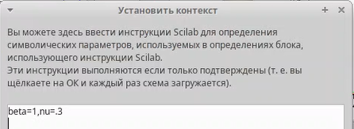{ #fig:pic1 width=100% }

Строю модель по аналогии с инструкцией(рис.[-@fig:pic2]).

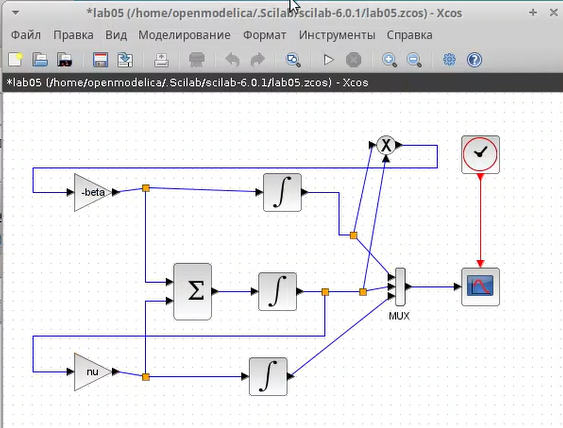{ #fig:pic2 width=100% }

Выходы трёх блоков интегрирования соединяем с мультиплексором. В параметрах верхнего и среднего блока интегрирования задаю начальные значения s(0) = 0, 999 и i(0) = 0, 001(рис.[-@fig:pic3]). (рис.[-@fig:pic4]).

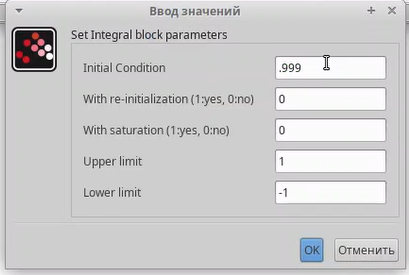{ #fig:pic3 width=100% }

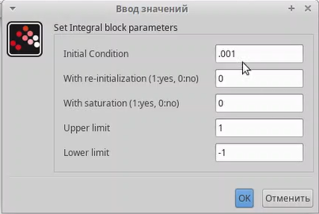{ #fig:pic4 width=100% }

Изменяю параметры блока суммирования(рис.[-@fig:pic5]).

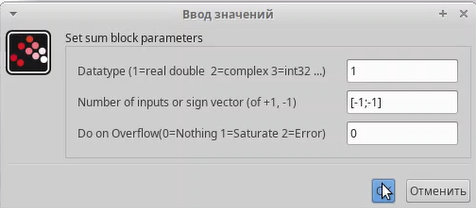{ #fig:pic5 width=100% }

изменяю параметры моделирования и ставлю конечное время интегрирования на 30(рис.[-@fig:pic6]).

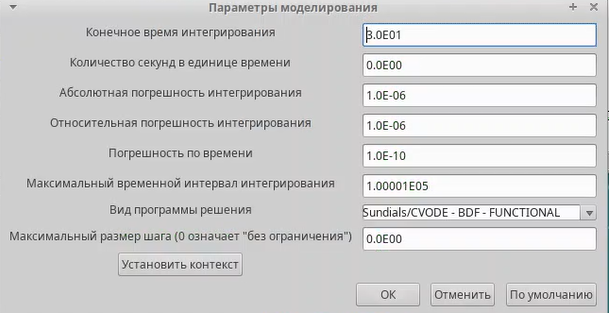{ #fig:pic6 width=100% }

Результат прпограммы - график(рис.[-@fig:pic7]).

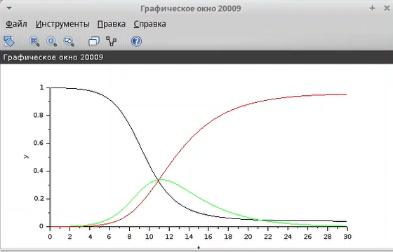{ #fig:pic7 width=100% }

Реализация модели с помощью блока Modelica в xcos.
Для реализации модели с помощью языка Modelica помимо блоков CLOCK_c, CSCOPE, TEXT_f и MUX требуются блоки CONST_m — задаёт константу; MBLOCK (Modelica generic) — блок реализации кода на языке Modelica. Задаём значения переменных β и ν. Переменные на входе (“beta”, “nu”) и выходе (“s”, “i”, “r”) блока заданы как внешние (“E”). реализую модель SIR в xcos с применением блока Modelica(рис.[-@fig:pic8]).

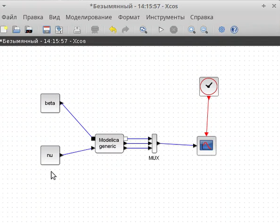{ #fig:pic8 width=100% }

Настраиваю Параметры блока Modelica для модели. Пишу Код на языке Modelica(рис.[-@fig:pic9]), (рис.[-@fig:pic10]).

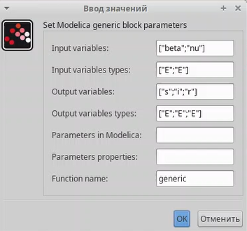{ #fig:pic9 width=100% }

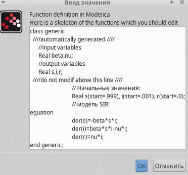{ #fig:pic10 width=100% }

Результат программы - график(рис.[-@fig:pic11]).

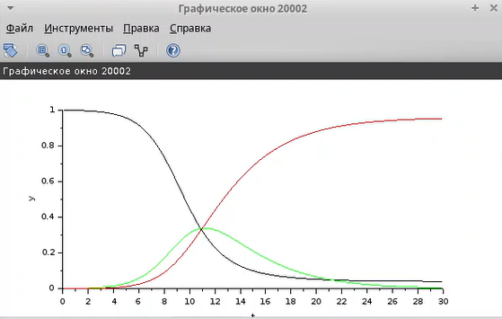{ #fig:pic11 width=100% }

Реализую модель SIR в OpenModelica(рис.[-@fig:pic12]).

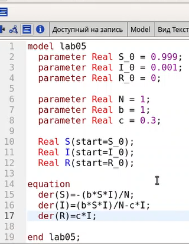{ #fig:pic12 width=100% }

Изменяю параметры моделирования и ставлю конечное время интегрирования на 30(рис.[-@fig:pic13]).

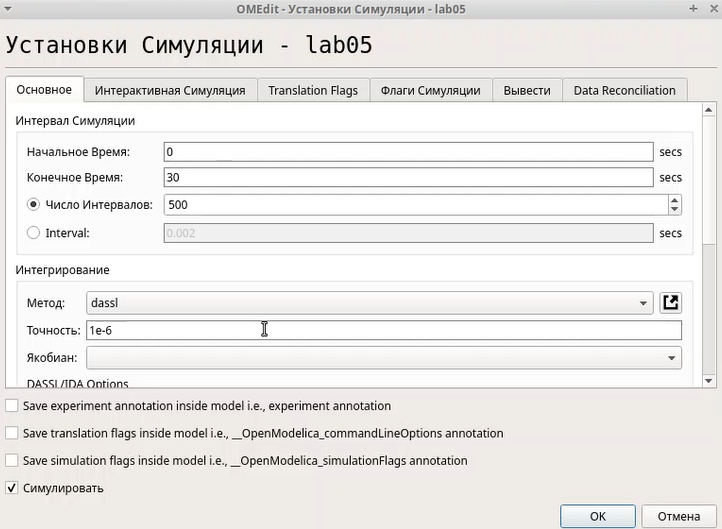{ #fig:pic13 width=100% }

Результат прпограммы - график(рис.[-@fig:pic14]).

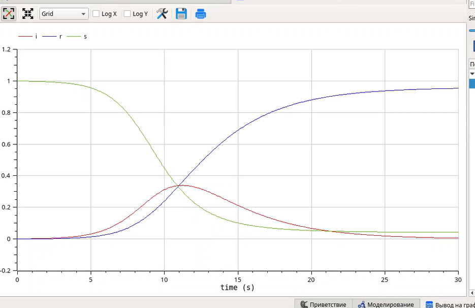{ #fig:pic14 width=100% }

Требуется:
– реализовать модель SIR с учётом процесса рождения / гибели особей в xcos (в
том числе и с использованием блока Modelica), а также в OpenModelica;
– построить графики эпидемического порога при различных значениях параметров
модели (в частности изменяя параметр μ);
– сделать анализ полученных графиков в зависимости от выбранных значений
параметров модели.

Зафиксируем начальные данные: β = 1, ν = 0, 3, mu = 0.1, s(0) = 0, 999, i(0) = 0, 001, r(0) = 0. В меню Моделирование, Задать переменные окружения задаю значения переменных β и ν. строю модель, подходящую под заданное уравнение(рис.[-@fig:pic15]).

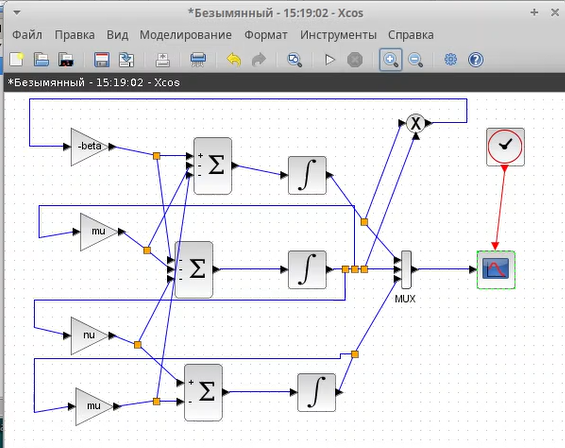{ #fig:pic15 width=100% }

Результат прпограммы - график(рис.[-@fig:pic16]).

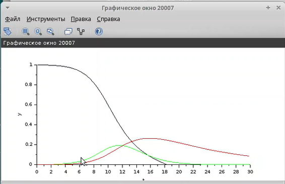{ #fig:pic16 width=100% }

Реализация модели с помощью блока Modelica в xcos.
Для реализации модели с помощью языка Modelica помимо блоков CLOCK_c, CSCOPE, TEXT_f и MUX требуются блоки CONST_m — задаёт константу; MBLOCK (Modelica generic) — блок реализации кода на языке Modelica. Задаём значения переменных β и ν. Переменные на входе (“beta”, “nu”. mu) и выходе (“s”, “i”, “r”) блока заданы как внешние (“E”). реализую модель SIR в xcos с применением блока Modelica(рис.[-@fig:pic17]).

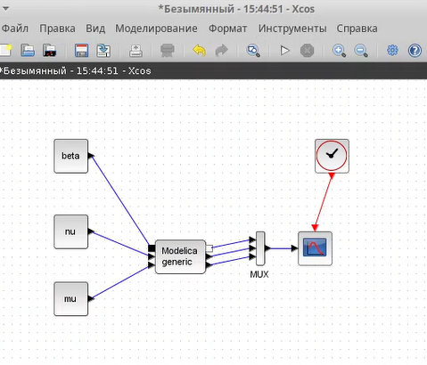{ #fig:pic17 width=100% }

Настраиваю Параметры блока Modelica для модели. Пишу Код на языке Modelica(рис.[-@fig:pic18]), (рис.[-@fig:pic19]).

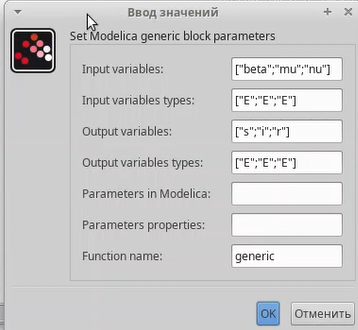{ #fig:pic18 width=100% }

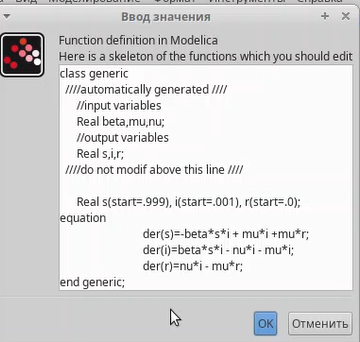{ #fig:pic19 width=100% }

Результат прпограммы - график(рис.[-@fig:pic20]).

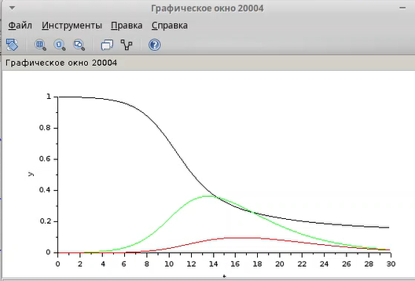{ #fig:pic20 width=100% }

Реализую модель SIR в OpenModelica. Изменяю параметры моделирования и ставлю конечное время интегрирования на 30(рис.[-@fig:pic21]).

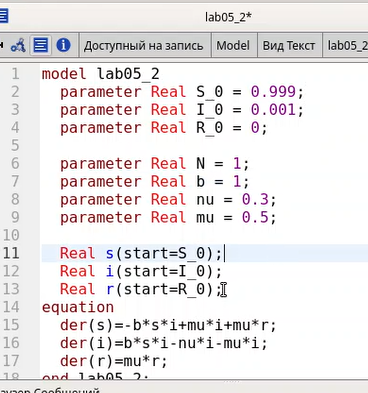{ #fig:pic21 width=100% }

Результат прпограммы - график(рис.[-@fig:pic22]).

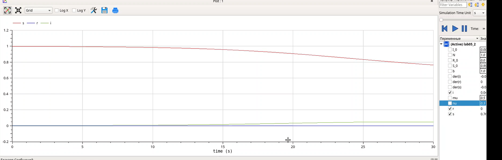{ #fig:pic22 width=100% }

# Выводы

Ознакомилась с Моделью эпидемии (SIR). Выполнила задания на эту тему.

# Список литературы{.unnumbered}

::: {#refs}
:::
