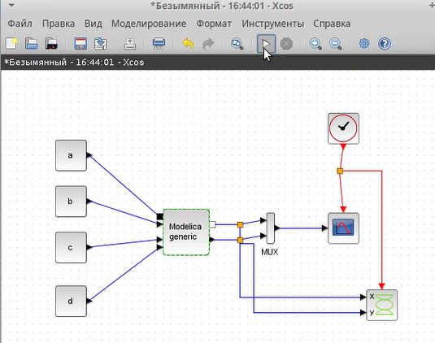

---
## Front matter
lang: ru-RU
title: Лабораторная работа №6
subtitle: Дисциплина - имитационное моделирование
author:
  - Пронякова О.М.
institute:
  - Российский университет дружбы народов, Москва, Россия
date: 04 марта 2025
## i18n babel
babel-lang: russian
babel-otherlangs: english

## Formatting pdf
toc: false
toc-title: Содержание
slide_level: 2
aspectratio: 169
section-titles: true
theme: metropolis
header-includes:
 - \metroset{progressbar=frametitle,sectionpage=progressbar,numbering=fraction}
---

# Информация

## Докладчик

:::::::::::::: {.columns align=center}
::: {.column width="70%"}

  * Пронякова Ольга Максимовна
  * студент НКАбд-02-22
  * факультет физико-математических и естественных наук
  * Российский университет дружбы народов

:::
::::::::::::::

# Создание презентации

## Цель работы

Ознакомиться с Моделью «хищник–жертва» и выполнить соответствующие задания на эту тему.

## Этапы выполнения работы

Реализация модели в xcos
Зафиксируем начальные данные: a = 2, b = 1, c = 0, 3, d = 1, x(0) = 2, y(0) = 1.
В меню Моделирование, Задать переменные окружения зададим значения коэффициентов a, b, c, d(рис.1).

{ #fig:pic1 width=100% }

## Этапы выполнения работы

Создаю соответствующую модель(рис.2).

{ #fig:pic2 width=100% }

## Этапы выполнения работы

Результат прпограммы - график и фазовый портрет(рис.3), (рис.4).

{ #fig:pic3 width=100% }

## Этапы выполнения работы

{ #fig:pic4 width=100% }

## Этапы выполнения работы

Реализация модели с помощью блока Modelica в xcos(рис.5), (рис.6).

{ #fig:pic5 width=100% }

## Этапы выполнения работы

{ #fig:pic6 width=100% }

## Этапы выполнения работы

Создаю соответствующую модель(рис.7).

{ #fig:pic7 width=100% }

## Этапы выполнения работы

Результат прпограммы - график и фазовый портрет(рис.8), (рис.9).

{ #fig:pic8 width=100% }

## Этапы выполнения работы

{ #fig:pic9 width=100% }

## Этапы выполнения работы

Реализую модель «хищник – жертва» в OpenModelica(рис.10).

{ #fig:pic10 width=100% }

## Этапы выполнения работы

Результат прпограммы - график и фазовый портрет(рис.11), (рис.12).

{ #fig:pic11 width=100% }

## Этапы выполнения работы

{ #fig:pic12 width=100% }

## Выводы

Ознакомилась с Моделью «хищник–жертва» и выполнила соответствующие задания на эту тему.

