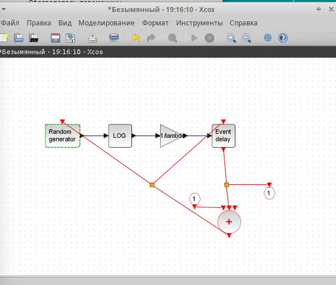
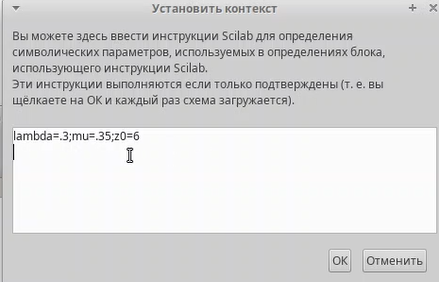
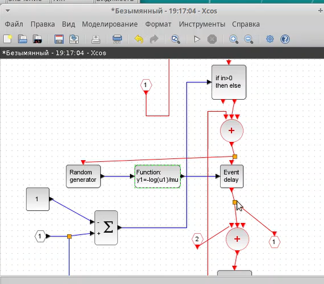
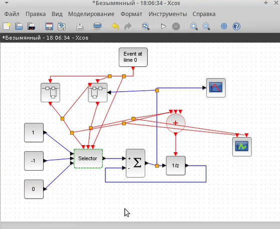
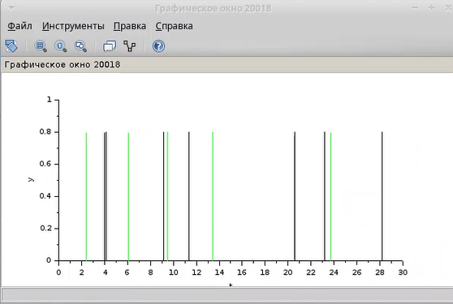
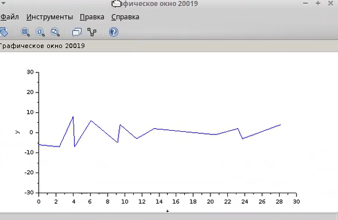

---
## Front matter
lang: ru-RU
title: Лабораторная работа №7
subtitle: Дисциплина - имитационное моделирование
author:
  - Пронякова О.М.
institute:
  - Российский университет дружбы народов, Москва, Россия
date: 04 марта 2025

## i18n babel
babel-lang: russian
babel-otherlangs: english

## Formatting pdf
toc: false
toc-title: Содержание
slide_level: 2
aspectratio: 169
section-titles: true
theme: metropolis
header-includes:
 - \metroset{progressbar=frametitle,sectionpage=progressbar,numbering=fraction}
---

# Информация

## Докладчик

:::::::::::::: {.columns align=center}
::: {.column width="70%"}

  * Пронякова Ольга Максимовна
  * студент НКАбд-02-22
  * факультет физико-математических и естественных наук
  * Российский университет дружбы народов

:::
::::::::::::::

# Создание презентации

## Цель работы

Рассмотреть пример моделирования в xcos системы массового обслуживания типа М|M|oo.

## Этапы выполнения работы

Зафиксируем данные. В меню Моделирование, Установить контекст зададим значение коэффициентов. пресступим к первому суперблоку, моделирующему поступление заявок. Заявки поступают в систему по пуассоновскому закону. Поступает заявка в суперблок, идет в синхранизатор входных и выходных сигналов, происходит равномерное распределение на интервале 0;1(также заявка идет в обработчик событий), далее идет преобразование в экспоненциальное распределение с параметром лямбда, далее заявка опять попадает в обработчик событий и выходит из суперблока.(рис.1), (рис.2).

## Этапы выполнения работы

{ #fig:pic1 width=100% }

## Этапы выполнения работы

{ #fig:pic2 width=100% }

## Этапы выполнения работы

приступаем ко второму суперблоку. Суперблок, моделирующий процесс обработки заявок. Тут происходит обработка заявок в очереди по экспоненциальному закону(рис.3).

{ #fig:pic3 width=100% }

## Этапы выполнения работы

Готовая модель. Тут есть селектор, два суперблока, построенных ранее, первоначальное событие на вход в суперблок, суммирование. оператор задержки(имитация очереди), также есть регистрирующие блоки: регистратор размера очереди и регистратор событий.(рис.4).

{ #fig:pic4 width=100% }

## Этапы выполнения работы

Результат моделирования - график динамики очереди начинается со значения 6(рис.5). (рис.6).

{ #fig:pic5 width=100% }

## Этапы выполнения работы

{ #fig:pic6 width=100% }

## Выводы

Я рассмотрела пример моделирования в xcos системы массового обслуживания типа М|M|oo

