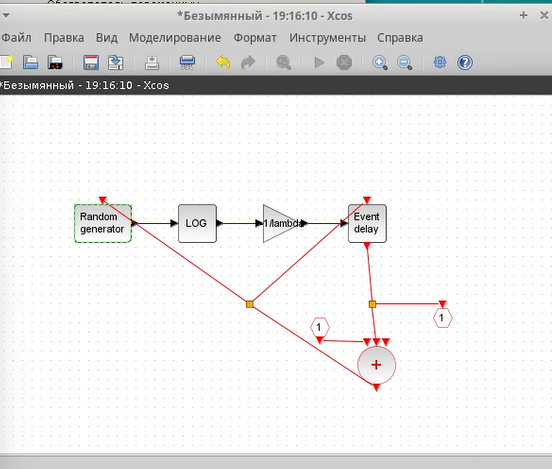
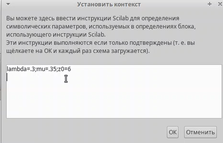
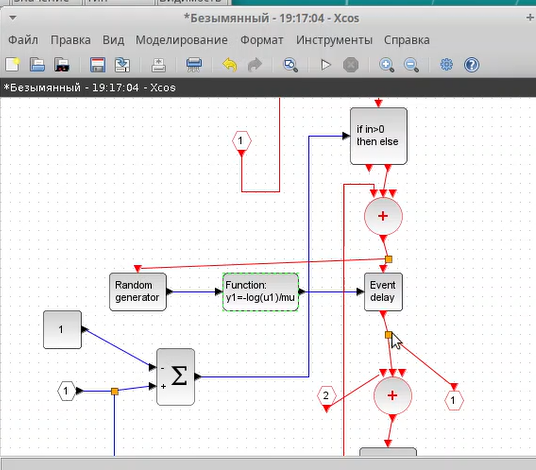
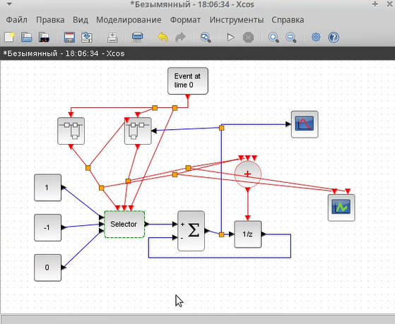
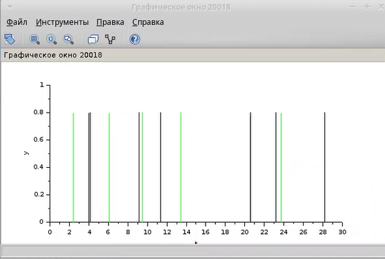
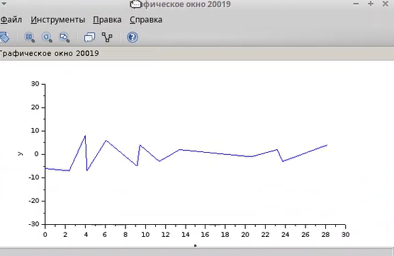

---
## Front matter
title: "Лабораторная работа №7"
subtitle: "Дисциплина: Имитационное моделирование"
author: "Пронякова Ольга Максимовна"

## Generic otions
lang: ru-RU
toc-title: "Содержание"

## Bibliography
bibliography: bib/cite.bib
csl: pandoc/csl/gost-r-7-0-5-2008-numeric.csl

## Pdf output format
toc: true # Table of contents
toc-depth: 2
lof: true # List of figures
lot: true # List of tables
fontsize: 12pt
linestretch: 1.5
papersize: a4
documentclass: scrreprt
## I18n polyglossia
polyglossia-lang:
  name: russian
  options:
	- spelling=modern
	- babelshorthands=true
polyglossia-otherlangs:
  name: english
## I18n babel
babel-lang: russian
babel-otherlangs: english
## Fonts
mainfont: IBM Plex Serif
romanfont: IBM Plex Serif
sansfont: IBM Plex Sans
monofont: IBM Plex Mono
mathfont: STIX Two Math
mainfontoptions: Ligatures=Common,Ligatures=TeX,Scale=0.94
romanfontoptions: Ligatures=Common,Ligatures=TeX,Scale=0.94
sansfontoptions: Ligatures=Common,Ligatures=TeX,Scale=MatchLowercase,Scale=0.94
monofontoptions: Scale=MatchLowercase,Scale=0.94,FakeStretch=0.9
mathfontoptions:
## Biblatex
biblatex: true
biblio-style: "gost-numeric"
biblatexoptions:
  - parentracker=true
  - backend=biber
  - hyperref=auto
  - language=auto
  - autolang=other*
  - citestyle=gost-numeric
## Pandoc-crossref LaTeX customization
figureTitle: "Рис."
tableTitle: "Таблица"
listingTitle: "Листинг"
lofTitle: "Список иллюстраций"
lotTitle: "Список таблиц"
lolTitle: "Листинги"
## Misc options
indent: true
header-includes:
  - \usepackage{indentfirst}
  - \usepackage{float} # keep figures where there are in the text
  - \floatplacement{figure}{H} # keep figures where there are in the text
---

# Цель работы

Рассмотреть пример моделирования в xcos системы массового обслуживания типа М|M|oo.

# Выполнение лабораторной работы

Зафиксируем данные. В меню Моделирование, Установить контекст зададим значение коэффициентов. пресступим к первому суперблоку, моделирующему поступление заявок. Заявки поступают в систему по пуассоновскому закону. Поступает заявка в суперблок, идет в синхранизатор входных и выходных сигналов, происходит равномерное распределение на интервале 0;1(также заявка идет в обработчик событий), далее идет преобразование в экспоненциальное распределение с параметром лямбда, далее заявка опять попадает в обработчик событий и выходит из суперблока.(рис.[-@fig:pic1]), (рис.[-@fig:pic2]).

{ #fig:pic1 width=100% }

{ #fig:pic2 width=100% }

приступаем ко второму суперблоку. Суперблок, моделирующий процесс обработки заявок. Тут происходит обработка заявок в очереди по экспоненциальному закону(рис.[-@fig:pic3]).

{ #fig:pic3 width=100% }

Готовая модель. Тут есть селектор, два суперблока, построенных ранее, первоначальное событие на вход в суперблок, суммирование. оператор задержки(имитация очереди), также есть регистрирующие блоки: регистратор размера очереди и регистратор событий.(рис.[-@fig:pic4]).

{ #fig:pic4 width=100% }

Результат моделирования - график динамики очереди начинается со значения 6(рис.[-@fig:pic5]). (рис.[-@fig:pic6]).

{ #fig:pic5 width=100% }

{ #fig:pic6 width=100% }

# Выводы

Я рассмотрела пример моделирования в xcos системы массового обслуживания типа М|M|oo

# Список литературы{.unnumbered}

::: {#refs}
:::
