---
## Front matter
lang: ru-RU
title: Лабораторная работа №8
subtitle: Дисциплина - имитационное моделирование
author:
  - Пронякова О.М.
institute:
  - Российский университет дружбы народов, Москва, Россия
date: 28 марта 2025

## i18n babel
babel-lang: russian
babel-otherlangs: english

## Formatting pdf
toc: false
toc-title: Содержание
slide_level: 2
aspectratio: 169
section-titles: true
theme: metropolis
header-includes:
 - \metroset{progressbar=frametitle,sectionpage=progressbar,numbering=fraction}
---

# Информация

## Докладчик

:::::::::::::: {.columns align=center}
::: {.column width="70%"}

  * Пронякова Ольга Максимовна
  * студент НКАбд-02-22
  * факультет физико-математических и естественных наук
  * Российский университет дружбы народов

:::
::::::::::::::

# Создание презентации

## Цель работы

Рассмотреть упрощённую модель поведения TCP-подобного трафика с регулируемой некоторым AQM алгоритмом динамической интенсивностью потока.

## Этапы выполнения работы

Hеализуем схему xcos, моделирующую систему, с начальными значениями параметров N = 1, R = 1, K = 5, 3, C = 1, W (0) = 0, 1, Q(0) = 1(рис.1).

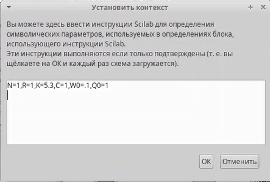{ #fig:pic1 width=100% }

## Этапы выполнения работы

Изменяю параметр выраажения(рис.2).

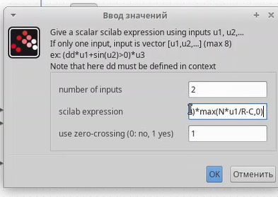{ #fig:pic2 width=100% }

## Этапы выполнения работы

Построение схемы по картинке(рис.3).

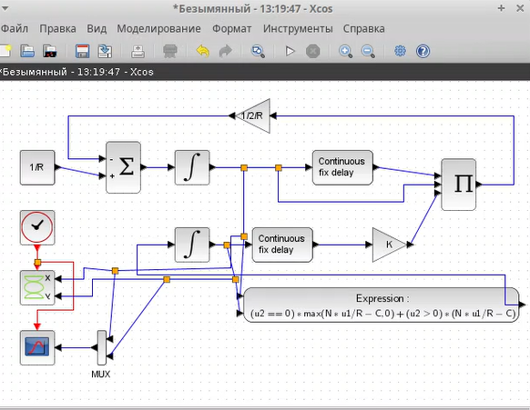{ #fig:pic3 width=100% }

## Этапы выполнения работы

Результат выполнения(рис.4), (рис.5).

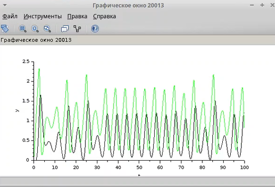{ #fig:pic4 width=100% }

## Этапы выполнения работы

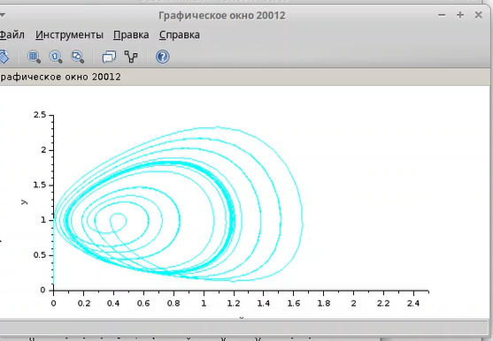{ #fig:pic5 width=100% }

## Этапы выполнения работы

Изменяю параметр С на 0.9(рис.6).

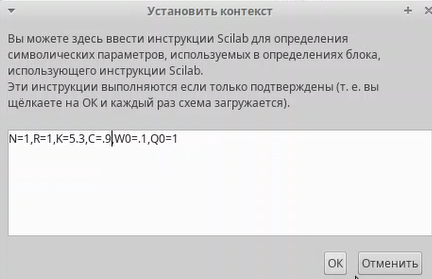{ #fig:pic6 width=100% }

## Этапы выполнения работы

Результат выполнения(рис.7), (рис.8).

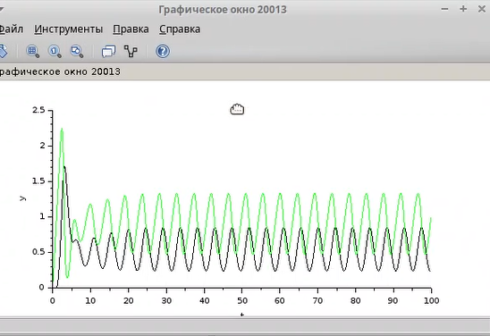{ #fig:pic7 width=100% }

## Этапы выполнения работы

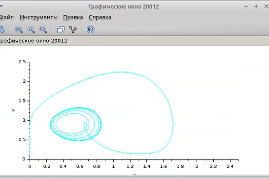{ #fig:pic8 width=100% }

## Этапы выполнения работы

Реализую модель с использованием языка Modelica в среде OpenModelica. Для реализации задержки использую оператор delay()(рис.9).

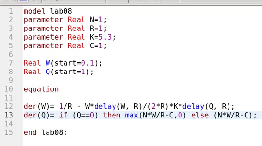{ #fig:pic9 width=100% }

## Этапы выполнения работы

Результат выполнения(рис.10]), (рис.11).

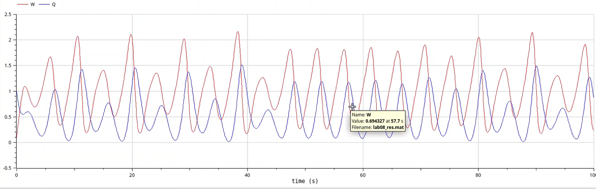{ #fig:pic10 width=100% }

## Этапы выполнения работы

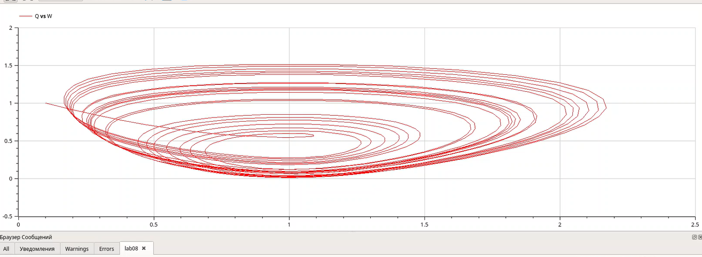{ #fig:pic11 width=100% }

## Этапы выполнения работы

Изменяю параметр С на 0.9(рис.12).

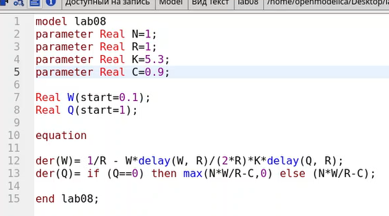{ #fig:pic12 width=100% }

## Этапы выполнения работы

Результат выполнения(рис.13), (рис.14).

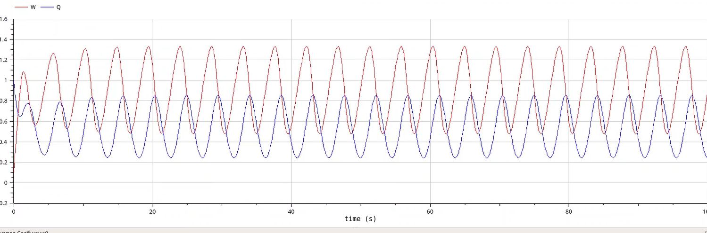{ #fig:pic13 width=100% }

## Этапы выполнения работы

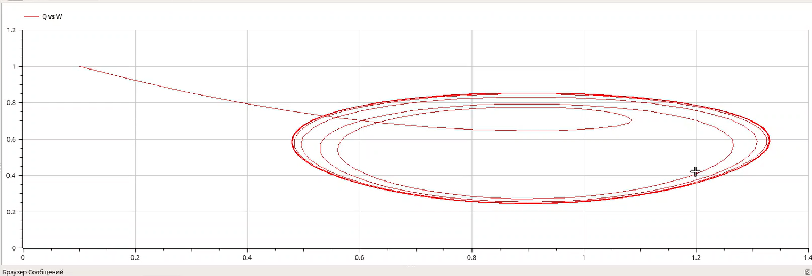{ #fig:pic14 width=100% }

## Выводы

Рассмотрела упрощённую модель поведения TCP-подобного трафика с регулируемой некоторым AQM алгоритмом динамической интенсивностью потока.

