---
## Front matter
title: "Лабораторная работа №8"
subtitle: "Дисциплина: Имитационное моделирование"
author: "Пронякова Ольга Максимовна"

## Generic otions
lang: ru-RU
toc-title: "Содержание"

## Bibliography
bibliography: bib/cite.bib
csl: pandoc/csl/gost-r-7-0-5-2008-numeric.csl

## Pdf output format
toc: true # Table of contents
toc-depth: 2
lof: true # List of figures
lot: true # List of tables
fontsize: 12pt
linestretch: 1.5
papersize: a4
documentclass: scrreprt
## I18n polyglossia
polyglossia-lang:
  name: russian
  options:
	- spelling=modern
	- babelshorthands=true
polyglossia-otherlangs:
  name: english
## I18n babel
babel-lang: russian
babel-otherlangs: english
## Fonts
mainfont: IBM Plex Serif
romanfont: IBM Plex Serif
sansfont: IBM Plex Sans
monofont: IBM Plex Mono
mathfont: STIX Two Math
mainfontoptions: Ligatures=Common,Ligatures=TeX,Scale=0.94
romanfontoptions: Ligatures=Common,Ligatures=TeX,Scale=0.94
sansfontoptions: Ligatures=Common,Ligatures=TeX,Scale=MatchLowercase,Scale=0.94
monofontoptions: Scale=MatchLowercase,Scale=0.94,FakeStretch=0.9
mathfontoptions:
## Biblatex
biblatex: true
biblio-style: "gost-numeric"
biblatexoptions:
  - parentracker=true
  - backend=biber
  - hyperref=auto
  - language=auto
  - autolang=other*
  - citestyle=gost-numeric
## Pandoc-crossref LaTeX customization
figureTitle: "Рис."
tableTitle: "Таблица"
listingTitle: "Листинг"
lofTitle: "Список иллюстраций"
lotTitle: "Список таблиц"
lolTitle: "Листинги"
## Misc options
indent: true
header-includes:
  - \usepackage{indentfirst}
  - \usepackage{float} # keep figures where there are in the text
  - \floatplacement{figure}{H} # keep figures where there are in the text
---

# Цель работы

Рассмотреть упрощённую модель поведения TCP-подобного трафика с регулируемой некоторым AQM алгоритмом динамической интенсивностью потока.

# Выполнение лабораторной работы

Hеализуем схему xcos, моделирующую систему, с начальными значениями параметров N = 1, R = 1, K = 5, 3, C = 1, W (0) = 0, 1, Q(0) = 1(рис.[-@fig:pic1]).

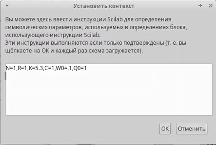{ #fig:pic1 width=100% }

Изменяю параметр выраажения(рис.[-@fig:pic2]).

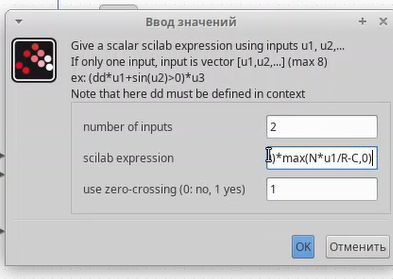{ #fig:pic2 width=100% }

Построение схемы по картинке(рис.[-@fig:pic3]).

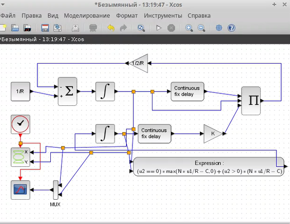{ #fig:pic3 width=100% }

Результат выполнения(рис.[-@fig:pic4]), (рис.[-@fig:pic5]).

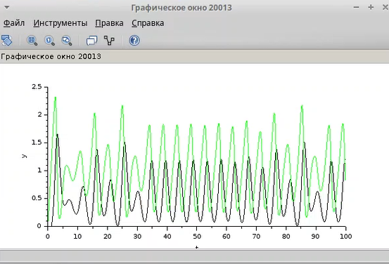{ #fig:pic4 width=100% }

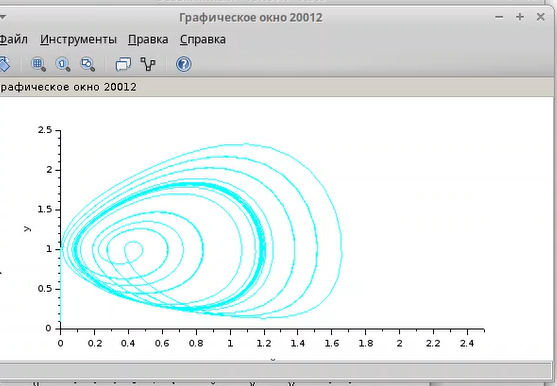{ #fig:pic5 width=100% }

Изменяю параметр С на 0.9(рис.[-@fig:pic6]).

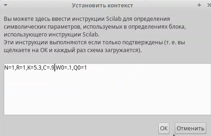{ #fig:pic6 width=100% }

Результат выполнения(рис.[-@fig:pic7]), (рис.[-@fig:pic8]).

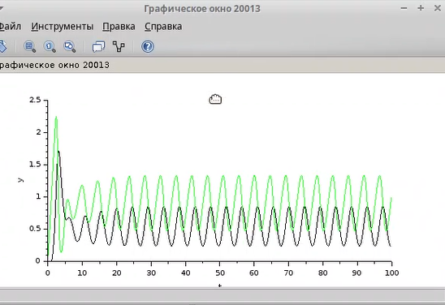{ #fig:pic7 width=100% }

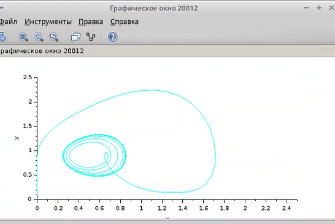{ #fig:pic8 width=100% }

Реализую модель с использованием языка Modelica в среде OpenModelica. Для реализации задержки использую оператор delay()(рис.[-@fig:pic9]).

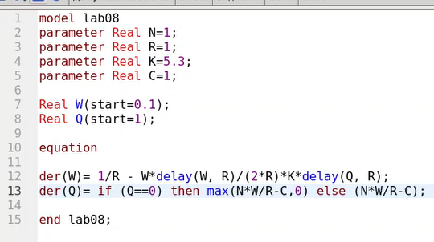{ #fig:pic9 width=100% }

Результат выполнения(рис.[-@fig:pic10]), (рис.[-@fig:pic11]).

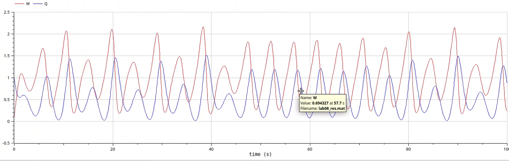{ #fig:pic10 width=100% }

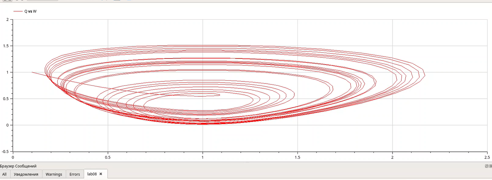{ #fig:pic11 width=100% }

Изменяю параметр С на 0.9(рис.[-@fig:pic12]).

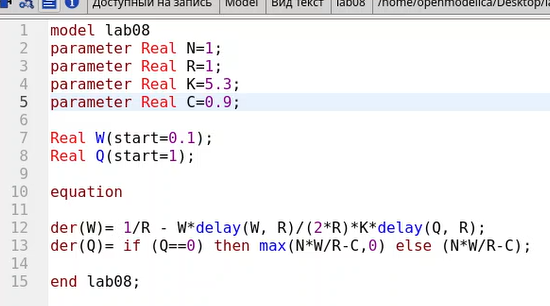{ #fig:pic12 width=100% }

Результат выполнения(рис.[-@fig:pic13]), (рис.[-@fig:pic14]).

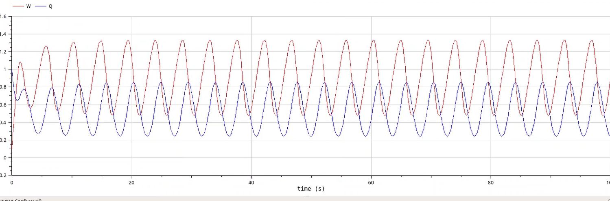{ #fig:pic13 width=100% }

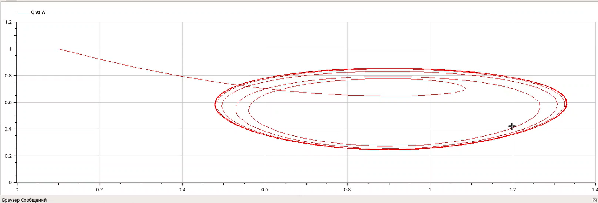{ #fig:pic14 width=100% }

# Выводы

Рассмотрела упрощённую модель поведения TCP-подобного трафика с регулируемой некоторым AQM алгоритмом динамической интенсивностью потока.

# Список литературы{.unnumbered}

::: {#refs}
:::
