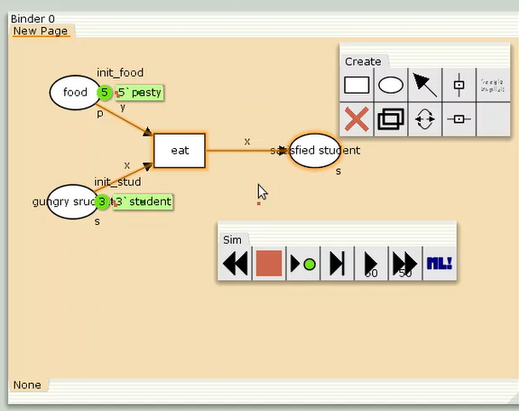
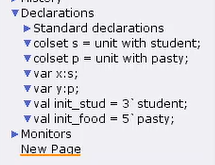
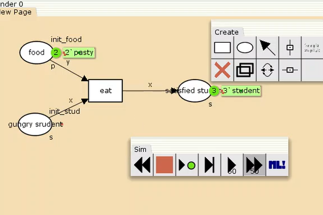
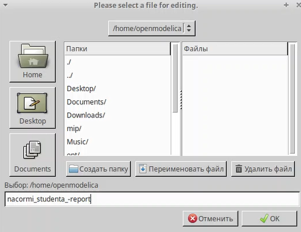
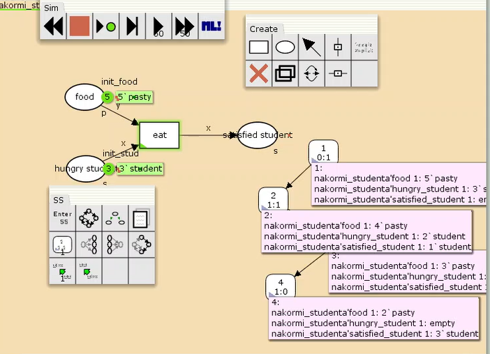
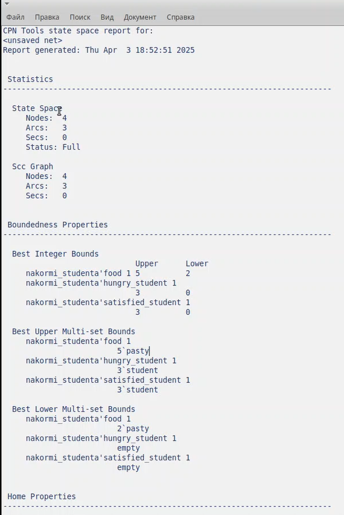

---
## Front matter
lang: ru-RU
title: Лабораторная работа №9
subtitle: Дисциплина - имитационное моделирование
author:
  - Пронякова О.М.
institute:
  - Российский университет дружбы народов, Москва, Россия
date: 03 апреля 2025

## i18n babel
babel-lang: russian
babel-otherlangs: english

## Formatting pdf
toc: false
toc-title: Содержание
slide_level: 2
aspectratio: 169
section-titles: true
theme: metropolis
header-includes:
 - \metroset{progressbar=frametitle,sectionpage=progressbar,numbering=fraction}
---

# Информация

## Докладчик

:::::::::::::: {.columns align=center}
::: {.column width="70%"}

  * Пронякова Ольга Максимовна
  * студент НКАбд-02-22
  * факультет физико-математических и естественных наук
  * Российский университет дружбы народов

:::
::::::::::::::

# Создание презентации

## Цель работы

Ознакомиться с Моделью «Накорми студентов».
Рассмотрим пример студентов, обедающих пирогами. Голодный студент стано-
вится сытым после того, как съедает пирог.

## Этапы выполнения работы

Рассмотрим пример студентов, обедающих пирогами. Голодный студент стано-
вится сытым после того, как съедает пирог.
Таким образом, имеем:
– два типа фишек: «пироги» и «студенты»;
– три позиции: «голодный студент», «пирожки», «сытый студент»;
– один переход: «съесть пирожок».
 Рисуем граф сети. Для этого с помощью контекстного меню создаём новую сеть, добавляем позиции, переход и дуги(рис.1).
 
 ## Этапы выполнения работы

{ #fig:pic1 width=100% }

## Этапы выполнения работы

В меню задаём новые декларации модели: типы фишек, начальные значения
позиций, выражения для дуг. Для этого наведя мышку на меню Standart declarations,
правой кнопкой вызываем контекстное меню и выбираем New Decl. После этого задаем тип s фишкам, относящимся к студентам, тип p — фишкам, относящимся к пирогам, задаём значения переменных x и y для дуг и начальные значения мультимножеств init_stud и init_food(рис.2).

{ #fig:pic2 width=100% }

## Этапы выполнения работы

Запускаем нашу модель(рис.3).

{ #fig:pic3 width=100% }

## Этапы выполнения работы

Вычисляю пространство состояний. Формирую отчёт о пространстве состояний и анализирую его. Строю граф пространства состояний(рис.4), (рис.5), (рис.6).

## Этапы выполнения работы

{ #fig:pic4 width=100% }

## Этапы выполнения работы

{ #fig:pic5 width=100% }

## Этапы выполнения работы

{ #fig:pic6 width=100% }

## Выводы

Ознакомилась с Моделью «Накорми студентов».
Рассмотрела пример студентов, обедающих пирогами. Голодный студент стано-
вится сытым после того, как съедает пирог.

