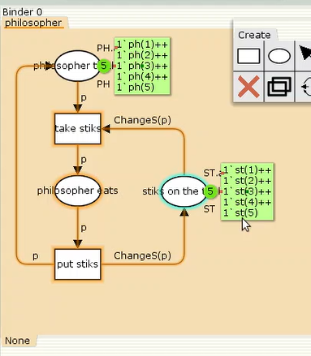
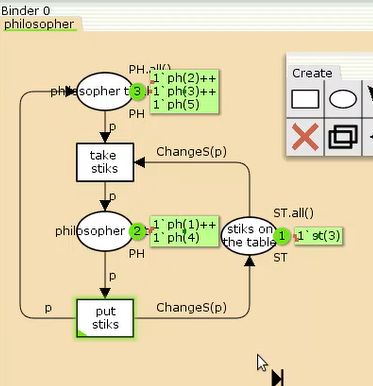
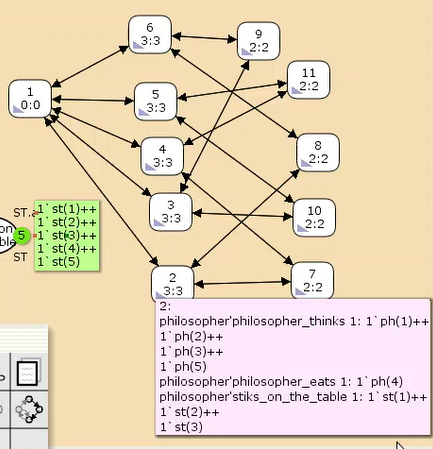
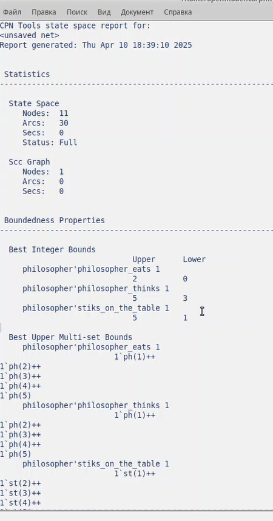

---
## Front matter
lang: ru-RU
title: Лабораторная работа №10
subtitle: Дисциплина - имитационное моделирование
author:
  - Пронякова О.М.
institute:
  - Российский университет дружбы народов, Москва, Россия
date: 03 апреля 2025

## i18n babel
babel-lang: russian
babel-otherlangs: english

## Formatting pdf
toc: false
toc-title: Содержание
slide_level: 2
aspectratio: 169
section-titles: true
theme: metropolis
header-includes:
 - \metroset{progressbar=frametitle,sectionpage=progressbar,numbering=fraction}
---

# Информация

## Докладчик

:::::::::::::: {.columns align=center}
::: {.column width="70%"}

  * Пронякова Ольга Максимовна
  * студент НКАбд-02-22
  * факультет физико-математических и естественных наук
  * Российский университет дружбы народов

:::
::::::::::::::

# Создание презентации

## Цель работы

Познокомиться и разобраться с задачей об обедающих мудрецах — классическая задача о блокировках и синхронизации процессов.

## Этапы выполнения работы

Пять мудрецов сидят за круглым столом и могут пребывать в двух состояниях —
думать и есть. Между соседями лежит одна палочка для еды. Для приёма пищи
необходимы две палочки. Палочки — пересекающийся ресурс. Необходимо синхро-
низировать процесс еды так, чтобы мудрецы не умерли с голода.

Построение модели с помощью CPNTools
1. Рисуем граф сети. Для этого с помощью контекстного меню создаём новую сеть,
добавляем позиции, переходы и дуги (рис. 10.1).
Начальные данные:
– позиции: мудрец размышляет (philosopher thinks), мудрец ест (philosopher eats),
палочки находятся на столе (sticks on the table)
– переходы: взять палочки (take sticks), положить палочки (put sticks)

## Этапы выполнения работы

В меню задаём новые декларации модели: типы фишек, начальные значения
позиций, выражения для дуг:
– n — число мудрецов и палочек (n = 5);
– p — фишки, обозначающие мудрецов, имеют перечисляемый тип PH от 1 до n;
– s — фишки, обозначающие палочки, имеют перечисляемый тип ST от 1 до n;
– функция ChangeS(p) ставит в соответствие мудрецам палочки (возвращает но-
мера палочек, используемых мудрецами); по условию задачи мудрецы сидят по
кругу и мудрец p(i) может взять i и i + 1 палочки, поэтому функция ChangeS(p)
определяется следующим образом:
fun ChangeS (ph(i))=
1`st(i)++st(if = n then 1 else i+1)(рис.1).

## Этапы выполнения работы

{ #fig:pic1 width=100% }

## Этапы выполнения работы

Запуск программы(рис.2).

{ #fig:pic2 width=100% }

## Этапы выполнения работы

Формирую отчёт о пространстве состояний и проанализирую его. Строю граф пространства состояний(рис.3), (рис.4).

{ #fig:pic3 width=100% }

## Этапы выполнения работы

{ #fig:pic4 width=100% }

## Выводы

Познокомилась и разобраться с задачей об обедающих мудрецах — классическая задача о блокировках и синхронизации процессов.

