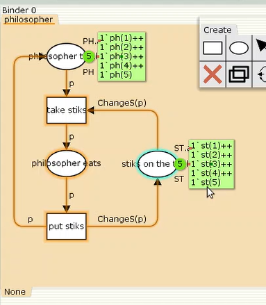
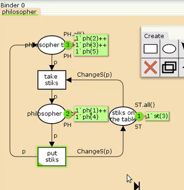
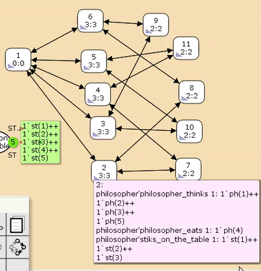
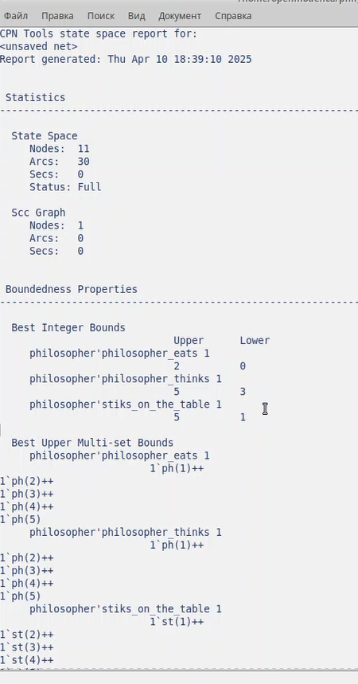

---
## Front matter
title: "Лабораторная работа №10"
subtitle: "Дисциплина: Имитационное моделирование"
author: "Пронякова Ольга Максимовна"

## Generic otions
lang: ru-RU
toc-title: "Содержание"

## Bibliography
bibliography: bib/cite.bib
csl: pandoc/csl/gost-r-7-0-5-2008-numeric.csl

## Pdf output format
toc: true # Table of contents
toc-depth: 2
lof: true # List of figures
lot: true # List of tables
fontsize: 12pt
linestretch: 1.5
papersize: a4
documentclass: scrreprt
## I18n polyglossia
polyglossia-lang:
  name: russian
  options:
	- spelling=modern
	- babelshorthands=true
polyglossia-otherlangs:
  name: english
## I18n babel
babel-lang: russian
babel-otherlangs: english
## Fonts
mainfont: IBM Plex Serif
romanfont: IBM Plex Serif
sansfont: IBM Plex Sans
monofont: IBM Plex Mono
mathfont: STIX Two Math
mainfontoptions: Ligatures=Common,Ligatures=TeX,Scale=0.94
romanfontoptions: Ligatures=Common,Ligatures=TeX,Scale=0.94
sansfontoptions: Ligatures=Common,Ligatures=TeX,Scale=MatchLowercase,Scale=0.94
monofontoptions: Scale=MatchLowercase,Scale=0.94,FakeStretch=0.9
mathfontoptions:
## Biblatex
biblatex: true
biblio-style: "gost-numeric"
biblatexoptions:
  - parentracker=true
  - backend=biber
  - hyperref=auto
  - language=auto
  - autolang=other*
  - citestyle=gost-numeric
## Pandoc-crossref LaTeX customization
figureTitle: "Рис."
tableTitle: "Таблица"
listingTitle: "Листинг"
lofTitle: "Список иллюстраций"
lotTitle: "Список таблиц"
lolTitle: "Листинги"
## Misc options
indent: true
header-includes:
  - \usepackage{indentfirst}
  - \usepackage{float} # keep figures where there are in the text
  - \floatplacement{figure}{H} # keep figures where there are in the text
---

# Цель работы

Познокомиться и разобраться с задачей об обедающих мудрецах — классическая задача о блокировках и синхронизации процессов.

# Выполнение лабораторной работы

Пять мудрецов сидят за круглым столом и могут пребывать в двух состояниях —
думать и есть. Между соседями лежит одна палочка для еды. Для приёма пищи
необходимы две палочки. Палочки — пересекающийся ресурс. Необходимо синхро-
низировать процесс еды так, чтобы мудрецы не умерли с голода.

Построение модели с помощью CPNTools
1. Рисуем граф сети. Для этого с помощью контекстного меню создаём новую сеть,
добавляем позиции, переходы и дуги (рис. 10.1).
Начальные данные:
– позиции: мудрец размышляет (philosopher thinks), мудрец ест (philosopher eats),
палочки находятся на столе (sticks on the table)
– переходы: взять палочки (take sticks), положить палочки (put sticks)

В меню задаём новые декларации модели: типы фишек, начальные значения
позиций, выражения для дуг:
– n — число мудрецов и палочек (n = 5);
– p — фишки, обозначающие мудрецов, имеют перечисляемый тип PH от 1 до n;
– s — фишки, обозначающие палочки, имеют перечисляемый тип ST от 1 до n;
– функция ChangeS(p) ставит в соответствие мудрецам палочки (возвращает но-
мера палочек, используемых мудрецами); по условию задачи мудрецы сидят по
кругу и мудрец p(i) может взять i и i + 1 палочки, поэтому функция ChangeS(p)
определяется следующим образом:
fun ChangeS (ph(i))=
1`st(i)++st(if = n then 1 else i+1)(рис.[-@fig:pic1]).

{ #fig:pic1 width=100% }

Запуск программы(рис.[-@fig:pic2]).

{ #fig:pic2 width=100% }

Формирую отчёт о пространстве состояний и проанализирую его. Строю граф пространства состояний(рис.[-@fig:pic3]), (рис.[-@fig:pic3]).

{ #fig:pic3 width=100% }

{ #fig:pic4 width=100% }

# Выводы

Познокомилась и разобраться с задачей об обедающих мудрецах — классическая задача о блокировках и синхронизации процессов.

# Список литературы{.unnumbered}

::: {#refs}
:::
