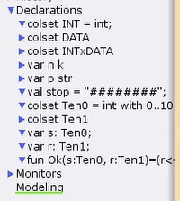
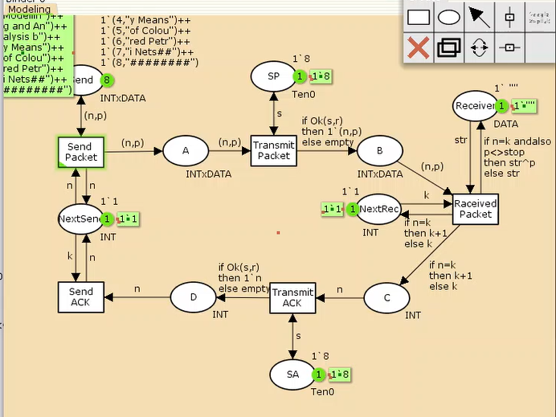
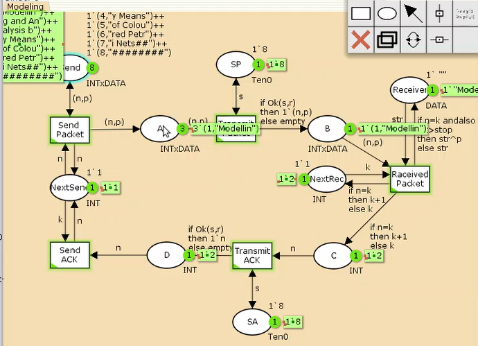
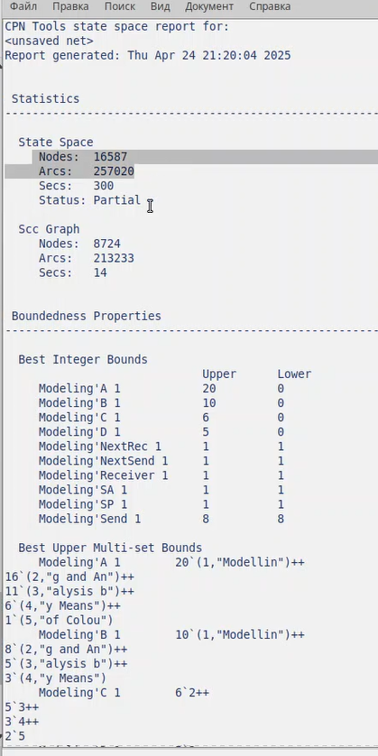

---
## Front matter
lang: ru-RU
title: Лабораторная работа №12
subtitle: Дисциплина - имитационное моделирование
author:
  - Пронякова О.М.
institute:
  - Российский университет дружбы народов, Москва, Россия
date: 03 апреля 2025

## i18n babel
babel-lang: russian
babel-otherlangs: english

## Formatting pdf
toc: false
toc-title: Содержание
slide_level: 2
aspectratio: 169
section-titles: true
theme: metropolis
header-includes:
 - \metroset{progressbar=frametitle,sectionpage=progressbar,numbering=fraction}
---

# Информация

## Докладчик

:::::::::::::: {.columns align=center}
::: {.column width="70%"}

  * Пронякова Ольга Максимовна
  * студент НКАбд-02-22
  * факультет физико-математических и естественных наук
  * Российский университет дружбы народов

:::
::::::::::::::

# Создание презентации

## Цель работы

Рассмотреть ненадёжную сеть передачи данных, состоящую из источника, получателя.

## Этапы выполнения работы

Основные состояния: источник (Send), получатель (Receiver).
Действия (переходы): отправить пакет (Send Packet), отправить подтверждение
(Send ACK). Промежуточное состояние: следующий посылаемый пакет (NextSend).
Зададим декларации модели(рис.1).

## Этапы выполнения работы

{ #fig:pic1 width=100% }

## Этапы выполнения работы

Состояние Receiver имеет тип DATA и начальное значение 1`"" (т.е. пустая
строка, поскольку состояние собирает данные и номер пакета его не интересует).
Состояние NextSend имеет тип INT и начальное значение 1`1.
Поскольку пакеты представляют собой кортеж, состоящий из номера пакета и стро-
ки, то выражение у двусторонней дуги будет иметь значение (n,p).
Кроме того, необходимо взаимодействовать с состоянием, которое будет сообщать
номер следующего посылаемого пакета данных. Поэтому переход Send Packet
соединяем с состоянием NextSend двумя дугами с выражениями n.
Также необходимо получать информацию с подтверждениями о получении дан-
ных. От перехода Send Packet к состоянию NextSend дуга с выражением n,
обратно — k.

## Этапы выполнения работы

Зададим промежуточные состояния (A, B с типом INTxDATA, C, D с типом
INTxDATA) для переходов: передать пакет Transmit Packet (передаём
(n,p)), передать подтверждение Transmit ACK (передаём целое число k).
Добавляем переход получения пакета (Receive Packet).
От состояния Receiver идёт дуга к переходу Receive Packet со значением той
строки (str), которая находится в состоянии Receiver. Обратно: проверяем, что
номер пакета новый и строка не равна стоп-биту. Если это так, то строку добавляем
к полученным данным.
Кроме того, необходимо знать, каким будет номер следующего пакета. Для этого
добавляем состояние NextRec с типом INT и начальным значением 1`1 (один пакет),
связываем его дугами с переходом Receive Packet. Причём к переходу идёт дуга
с выражением k, от перехода — if n=k then k+1 else k.
Связываем состояния B и C с переходом Receive Packet. 

## Этапы выполнения работы

От состояния B
к переходу Receive Packet — выражение (n,p), от перехода Receive Packet
к состоянию C — выражение if n=k then k+1 else k.
От перехода Receive Packet к состоянию Receiver:
if n=k andalso p<>stop then str^p else str
(если n=k и мы не получили стоп-байт, то направляем в состояние строку и к ней
прикрепляем p, в противном случае посылаем толко строку).
На переходах Transmit Packet и Transmit ACK зададим потерю пакетов. Для
этого на интервале от 0 до 10 зададим пороговое значение и, если передаваемое значение превысит этот порог, то считаем, что произошла потеря пакета, если нет, то
передаём пакет дальше. Для этого задаём вспомогательные состояния SP и SA с типом
Ten0 и начальным значением 1`8, соединяем с соответствующими переходами.(рис.2).

## Этапы выполнения работы

{ #fig:pic2 width=100% }

## Этапы выполнения работы

Таким образом, получим модель простого протокола передачи данных.
Пакет последовательно проходит: состояние Send, переход Send Packet, состоя-
ние A, с некоторой вероятностью переход Transmit Packet, состояние B, попадает
на переход Receive Packet, где проверяется номер пакета и если нет совпадения,
то пакет направляется в состояние Received, а номер пакета передаётся после-
довательно в состояние C, с некоторой вероятностью в переход Transmit ACK,
далее в состояние D, переход Receive ACK, состояние NextSend (увеличивая на 1
номер следующего пакета), переход Send Packet. Так продолжается до тех пор,
пока не будут переданы все части сообщения. Последней будет передана стоп-
последовательность(рис.3).

## Этапы выполнения работы

{ #fig:pic3 width=100% }

## Этапы выполнения работы

Сформировала отчет о пространстве состояний(рис.4).

{ #fig:pic4 width=100% }

## Этапы выполнения работы

## Выводы

Рассмотрела ненадёжную сеть передачи данных, состоящую из источника, получателя.

