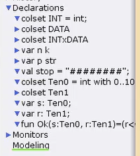
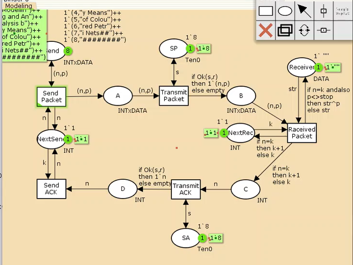

---
## Front matter
title: "Лабораторная работа №12"
subtitle: "Дисциплина: Имитационное моделирование"
author: "Пронякова Ольга Максимовна"

## Generic otions
lang: ru-RU
toc-title: "Содержание"

## Bibliography
bibliography: bib/cite.bib
csl: pandoc/csl/gost-r-7-0-5-2008-numeric.csl

## Pdf output format
toc: true # Table of contents
toc-depth: 2
lof: true # List of figures
lot: true # List of tables
fontsize: 12pt
linestretch: 1.5
papersize: a4
documentclass: scrreprt
## I18n polyglossia
polyglossia-lang:
  name: russian
  options:
	- spelling=modern
	- babelshorthands=true
polyglossia-otherlangs:
  name: english
## I18n babel
babel-lang: russian
babel-otherlangs: english
## Fonts
mainfont: IBM Plex Serif
romanfont: IBM Plex Serif
sansfont: IBM Plex Sans
monofont: IBM Plex Mono
mathfont: STIX Two Math
mainfontoptions: Ligatures=Common,Ligatures=TeX,Scale=0.94
romanfontoptions: Ligatures=Common,Ligatures=TeX,Scale=0.94
sansfontoptions: Ligatures=Common,Ligatures=TeX,Scale=MatchLowercase,Scale=0.94
monofontoptions: Scale=MatchLowercase,Scale=0.94,FakeStretch=0.9
mathfontoptions:
## Biblatex
biblatex: true
biblio-style: "gost-numeric"
biblatexoptions:
  - parentracker=true
  - backend=biber
  - hyperref=auto
  - language=auto
  - autolang=other*
  - citestyle=gost-numeric
## Pandoc-crossref LaTeX customization
figureTitle: "Рис."
tableTitle: "Таблица"
listingTitle: "Листинг"
lofTitle: "Список иллюстраций"
lotTitle: "Список таблиц"
lolTitle: "Листинги"
## Misc options
indent: true
header-includes:
  - \usepackage{indentfirst}
  - \usepackage{float} # keep figures where there are in the text
  - \floatplacement{figure}{H} # keep figures where there are in the text
---

# Цель работы

Рассмотреть ненадёжную сеть передачи данных, состоящую из источника, получателя.

# Выполнение лабораторной работы

Основные состояния: источник (Send), получатель (Receiver).
Действия (переходы): отправить пакет (Send Packet), отправить подтверждение
(Send ACK). Промежуточное состояние: следующий посылаемый пакет (NextSend).
Зададим декларации модели(рис.[-@fig:pic1]).

{ #fig:pic1 width=100% }

Состояние Receiver имеет тип DATA и начальное значение 1`"" (т.е. пустая
строка, поскольку состояние собирает данные и номер пакета его не интересует).
Состояние NextSend имеет тип INT и начальное значение 1`1.
Поскольку пакеты представляют собой кортеж, состоящий из номера пакета и стро-
ки, то выражение у двусторонней дуги будет иметь значение (n,p).
Кроме того, необходимо взаимодействовать с состоянием, которое будет сообщать
номер следующего посылаемого пакета данных. Поэтому переход Send Packet
соединяем с состоянием NextSend двумя дугами с выражениями n.
Также необходимо получать информацию с подтверждениями о получении дан-
ных. От перехода Send Packet к состоянию NextSend дуга с выражением n,
обратно — k.

Зададим промежуточные состояния (A, B с типом INTxDATA, C, D с типом
INTxDATA) для переходов: передать пакет Transmit Packet (передаём
(n,p)), передать подтверждение Transmit ACK (передаём целое число k).
Добавляем переход получения пакета (Receive Packet).
От состояния Receiver идёт дуга к переходу Receive Packet со значением той
строки (str), которая находится в состоянии Receiver. Обратно: проверяем, что
номер пакета новый и строка не равна стоп-биту. Если это так, то строку добавляем
к полученным данным.
Кроме того, необходимо знать, каким будет номер следующего пакета. Для этого
добавляем состояние NextRec с типом INT и начальным значением 1`1 (один пакет),
связываем его дугами с переходом Receive Packet. Причём к переходу идёт дуга
с выражением k, от перехода — if n=k then k+1 else k.
Связываем состояния B и C с переходом Receive Packet. От состояния B
к переходу Receive Packet — выражение (n,p), от перехода Receive Packet
к состоянию C — выражение if n=k then k+1 else k.
От перехода Receive Packet к состоянию Receiver:
if n=k andalso p<>stop then str^p else str
(если n=k и мы не получили стоп-байт, то направляем в состояние строку и к ней
прикрепляем p, в противном случае посылаем толко строку).
На переходах Transmit Packet и Transmit ACK зададим потерю пакетов. Для
этого на интервале от 0 до 10 зададим пороговое значение и, если передаваемое значение превысит этот порог, то считаем, что произошла потеря пакета, если нет, то
передаём пакет дальше. Для этого задаём вспомогательные состояния SP и SA с типом
Ten0 и начальным значением 1`8, соединяем с соответствующими переходами.(рис.[-@fig:pic2]).

{ #fig:pic2 width=100% }

Таким образом, получим модель простого протокола передачи данных.
Пакет последовательно проходит: состояние Send, переход Send Packet, состоя-
ние A, с некоторой вероятностью переход Transmit Packet, состояние B, попадает
на переход Receive Packet, где проверяется номер пакета и если нет совпадения,
то пакет направляется в состояние Received, а номер пакета передаётся после-
довательно в состояние C, с некоторой вероятностью в переход Transmit ACK,
далее в состояние D, переход Receive ACK, состояние NextSend (увеличивая на 1
номер следующего пакета), переход Send Packet. Так продолжается до тех пор,
пока не будут переданы все части сообщения. Последней будет передана стоп-
последовательность(рис.[-@fig:pic3]).

{ #fig:pic3 width=100% }

Сформировала отчет о пространстве состояний(рис.[-@fig:pic4]).

{ #fig:pic4 width=100% }

# Выводы

Рассмотрела ненадёжную сеть передачи данных, состоящую из источника, получателя.

# Список литературы{.unnumbered}

::: {#refs}
:::
