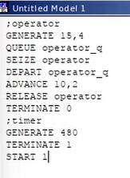
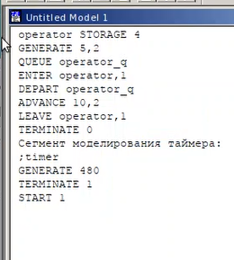

---
## Front matter
lang: ru-RU
title: Лабораторная работа №14
subtitle: Дисциплина - имитационное моделирование
author:
  - Пронякова О.М.
institute:
  - Российский университет дружбы народов, Москва, Россия
date: 03 апреля 2025

## i18n babel
babel-lang: russian
babel-otherlangs: english

## Formatting pdf
toc: false
toc-title: Содержание
slide_level: 2
aspectratio: 169
section-titles: true
theme: metropolis
header-includes:
 - \metroset{progressbar=frametitle,sectionpage=progressbar,numbering=fraction}
---

# Информация

## Докладчик

:::::::::::::: {.columns align=center}
::: {.column width="70%"}

  * Пронякова Ольга Максимовна
  * студент НКАбд-02-22
  * факультет физико-математических и естественных наук
  * Российский университет дружбы народов

:::
::::::::::::::

## Цель работы

Научиться работать с моделью обработки заказов.

## Задание

В интернет-магазине заказы принимает один оператор. Интервалы поступления
заказов распределены равномерно с интервалом 15 ± 4 мин. Время оформления
заказа также распределено равномерно на интервале 10 ± 2 мин. Обработка по-
ступивших заказов происходит в порядке очереди (FIFO). Требуется разработать
модель обработки заказов в течение 8 часов.

## Теоретическое введение

Порядок блоков в модели соответствует порядку фаз обработки заказа в реальной
системе:
1) клиент оставляет заявку на заказ в интернет-магазине;
2) если необходимо, заявка от клиента ожидает в очереди освобождения оператора
для оформления заказа;
3) заявка от клиента принимается оператором для оформления заказа;
4) оператор оформляет заказ;
5) клиент получает подтверждение об оформлении заказа (покидает систему).
Модель будет состоять из двух частей: моделирование обработки заказов
в интернет-магазине и задание времени моделирования.
Для задания равномерного распределения поступления заказов используем блок
GENERATE, для задания равномерного времени обслуживания (задержки в системе)
— ADVANCE. Для моделирования ожидания заявок клиентов в очереди используем
блоки QUEUE и DEPART, в которых в качестве имени очереди укажем operator_q
Для моделирования поступления заявок для оформления заказов к оператору ис-
пользуем блоки SEIZE и RELEASE с параметром operator — имени «устройства
обслуживания».

## Этапы выполнения работы

Построение модели(рис.1), (рис.2).

{ #fig:pic1 width=100% }

## Этапы выполнения работы

{ #fig:pic2 width=100% }

## Этапы выполнения работы

После запуска симуляции получаем отчёт.
Результаты работы модели:
– модельное время в начале моделирования: START TIME=0.0;
– абсолютное время или момент, когда счетчик завершений принял значение 0:
END TIME=480.0;
– количество блоков, использованных в текущей модели, к моменту завершения
моделирования: BLOCKS=9;
– количество одноканальных устройств, использованных в модели к моменту за-
вершения моделирования: FACILITIES=1;
– количество многоканальных устройств, использованных в текущей модели к мо-
менту завершения моделирования: STORAGES=0.
Имена, используемые в программе модели: operator, operator_q.

## Этапы выполнения работы

Далее идёт информация о блоках текущей модели, в частности, ENTRY COUNT —
количество транзактов, вошедших в блок с начала процедуры моделирования.
Затем идёт информация об одноканальном устройстве FACILITY (оператор,
оформляющий заказ), откуда видим, что к оператору попало 33 заказа от клиентов
(значение поля OWNER=33), но одну заявку оператор не успел принять в обработку
до окончания рабочего времени (значение поля ENTRIES=32). Полезность работы
оператора составила 0, 639. При этом среднее время занятости оператора составило
9, 589 мин.
Далее информация об очереди:
– QUEUE=operator_q — имя объекта типа «очередь»;
– MAX=1 — в очереди находилось не более одной ожидающей заявки от клиента;
– CONT=0 — на момент завершения моделирования очередь была пуста;
– ENTRIES=32 — общее число заявок от клиентов, прошедших через очередь в те-
чение периода моделирования;
– ENTRIES(O)=31 — число заявок от клиентов, попавших к оператору без ожидания
в очереди;
– AVE.CONT=0, 001 заявок от клиентов в среднем были в очереди;

## Этапы выполнения работы

– AVE.TIME=0.021 минут в среднем заявки от клиентов провели в очереди (с учётом
всех входов в очередь);
– AVE.(–0)=0, 671 минут в среднем заявки от клиентов провели в очереди (без
учета «нулевых» входов в очередь).
В конце отчёта идёт информация о будущих событиях:
– XN=33 — порядковый номер заявки от клиента, ожидающей поступления для
оформления заказа у оператора;
– PRI=0 — все клиенты (из заявки) равноправны;
– BDT=489, 786 — время назначенного события, связанного с данным транзактом;
– ASSEM=33 — номер семейства транзактов;
– CURRENT=5 — номер блока, в котором находится транзакт;
– NEXT=6 — номер блока, в который должен войти транзакт.

Скорректируйте модель в соответствии с изменениями входных
данных: интервалы поступления заказов распределены равномерно с интервалом
3.14 ± 1.7 мин; время оформления заказа также распределено равномерно на интер-
вале 6.66 ± 1.7 мин. Проанализируйте отчёт, сравнив результаты с результатами
предыдущего моделирования(рис.3), (рис.4).

## Этапы выполнения работы

{ #fig:pic3 width=100% }

## Этапы выполнения работы

{ #fig:pic4 width=100% }

## Этапы выполнения работы

Построение гистограммы(рис.5), (рис.6).

{ #fig:pic5 width=100% }

## Этапы выполнения работы

{ #fig:pic6 width=100% }

## Этапы выполнения работы

В интернет-магазин к одному оператору поступают два типа заявок от клиентов —
обычный заказ и заказ с оформление дополнительного пакета услуг. Заявки первого
типа поступают каждые 15 ± 4 мин. Заявки второго типа — каждые 30 ± 8 мин.
Оператор обрабатывает заявки по принципу FIFO («первым пришел — первым
обслужился»). Время, затраченное на оформление обычного заказа, составляет 10 ±
2 мин, а на оформление дополнительного пакета услуг — 5 ± 2 мин. Требуется
разработать модель обработки заказов в течение 8 часов, обеспечив сбор данных об
очереди заявок от клиентов(рис.7), (рис.8).

## Этапы выполнения работы

{ #fig:pic7 width=100% }

## Этапы выполнения работы

{ #fig:pic8 width=100% }

## Этапы выполнения работы

Скорректируйте модель так, чтобы учитывалось условие, что число
заказов с дополнительным пакетом услуг составляет 30% от общего числа заказов.
Используйте оператор TRANSFER. Проанализируйте отчёт(рис.9), (рис.10).

## Этапы выполнения работы

{ #fig:pic9 width=100% }

## Этапы выполнения работы

{ #fig:pic10 width=100% }

## Этапы выполнения работы

В интернет-магазине заказы принимают 4 оператора. Интервалы поступления зака-
зов распределены равномерно с интервалом 5 ± 2 мин. Время оформления заказа
каждым оператором также распределено равномерно на интервале 10 ± 2 мин. Об-
работка поступивших заказов происходит в порядке очереди (FIFO). Требуется
определить характеристики очереди заявок на оформление заказов при условии, что
заявка может обрабатываться одним из 4-х операторов в течение восьмичасового
рабочего дня(рис.11), (рис.12).

## Этапы выполнения работы

{ #fig:pic11 width=100% }

## Этапы выполнения работы

{ #fig:pic12 width=100% }

## Этапы выполнения работы

Измените модель: требуется учесть в ней возможные отказы клиентов от заказа
— когда при подаче заявки на заказ клиент видит в очереди более двух других
заявок, он отказывается от подачи заявки, то есть отказывается от обслуживания
(используйте блок TEST и стандартный числовой атрибут Qj текущей длины
очереди j)(рис.13), (рис.14).

## Этапы выполнения работы

{ #fig:pic13 width=100% }

## Этапы выполнения работы

{ #fig:pic14 width=100% }

## Выводы

Научилась работать с моделью обработки заказов.

