---
## Front matter
title: "Шаблон отчёта по лабораторной работе"
subtitle: "Простейший вариант"
author: "Дмитрий Сергеевич Кулябов"

## Generic otions
lang: ru-RU
## Front matter
title: "Лабораторная работа №14"
subtitle: "Дисциплина: Имитационное моделирование"
author: "Пронякова Ольга Максимовна"

## Generic otions
lang: ru-RU
toc-title: "Содержание"

## Bibliography
bibliography: bib/cite.bib
csl: pandoc/csl/gost-r-7-0-5-2008-numeric.csl

## Pdf output format
toc: true # Table of contents
toc-depth: 2
lof: true # List of figures
lot: true # List of tables
fontsize: 12pt
linestretch: 1.5
papersize: a4
documentclass: scrreprt
## I18n polyglossia
polyglossia-lang:
  name: russian
  options:
	- spelling=modern
	- babelshorthands=true
polyglossia-otherlangs:
  name: english
## I18n babel
babel-lang: russian
babel-otherlangs: english
## Fonts
mainfont: IBM Plex Serif
romanfont: IBM Plex Serif
sansfont: IBM Plex Sans
monofont: IBM Plex Mono
mathfont: STIX Two Math
mainfontoptions: Ligatures=Common,Ligatures=TeX,Scale=0.94
romanfontoptions: Ligatures=Common,Ligatures=TeX,Scale=0.94
sansfontoptions: Ligatures=Common,Ligatures=TeX,Scale=MatchLowercase,Scale=0.94
monofontoptions: Scale=MatchLowercase,Scale=0.94,FakeStretch=0.9
mathfontoptions:
## Biblatex
biblatex: true
biblio-style: "gost-numeric"
biblatexoptions:
  - parentracker=true
  - backend=biber
  - hyperref=auto
  - language=auto
  - autolang=other*
  - citestyle=gost-numeric
## Pandoc-crossref LaTeX customization
figureTitle: "Рис."
tableTitle: "Таблица"
listingTitle: "Листинг"
lofTitle: "Список иллюстраций"
lotTitle: "Список таблиц"
lolTitle: "Листинги"
## Misc options
indent: true
header-includes:
  - \usepackage{indentfirst}
  - \usepackage{float} # keep figures where there are in the text
  - \floatplacement{figure}{H} # keep figures where there are in the text
---

# Цель работы

Научиться работать с моделью обработки заказов.

# Задание

В интернет-магазине заказы принимает один оператор. Интервалы поступления
заказов распределены равномерно с интервалом 15 ± 4 мин. Время оформления
заказа также распределено равномерно на интервале 10 ± 2 мин. Обработка по-
ступивших заказов происходит в порядке очереди (FIFO). Требуется разработать
модель обработки заказов в течение 8 часов.

# Теоретическое введение

Порядок блоков в модели соответствует порядку фаз обработки заказа в реальной
системе:
1) клиент оставляет заявку на заказ в интернет-магазине;
2) если необходимо, заявка от клиента ожидает в очереди освобождения оператора
для оформления заказа;
3) заявка от клиента принимается оператором для оформления заказа;
4) оператор оформляет заказ;
5) клиент получает подтверждение об оформлении заказа (покидает систему).
Модель будет состоять из двух частей: моделирование обработки заказов
в интернет-магазине и задание времени моделирования.
Для задания равномерного распределения поступления заказов используем блок
GENERATE, для задания равномерного времени обслуживания (задержки в системе)
— ADVANCE. Для моделирования ожидания заявок клиентов в очереди используем
блоки QUEUE и DEPART, в которых в качестве имени очереди укажем operator_q
Для моделирования поступления заявок для оформления заказов к оператору ис-
пользуем блоки SEIZE и RELEASE с параметром operator — имени «устройства
обслуживания».

# Выполнение лабораторной работы

Построение модели(рис.[-@fig:pic1]), (рис.[-@fig:pic2]).

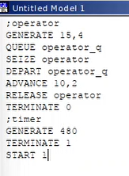{ #fig:pic1 width=100% }

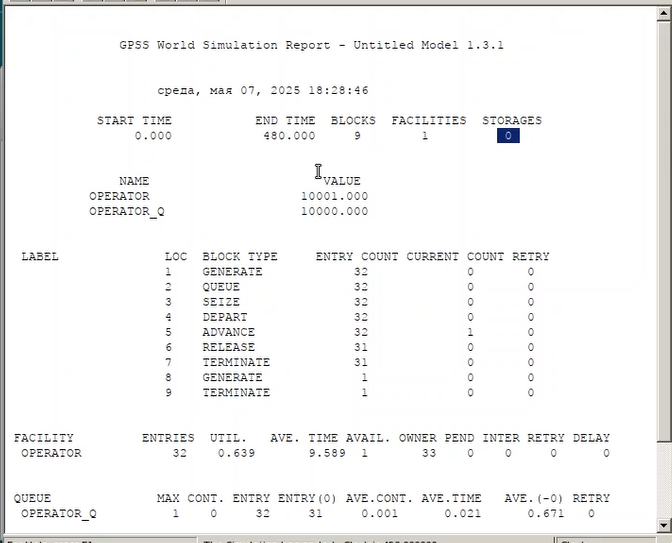{ #fig:pic2 width=100% }

После запуска симуляции получаем отчёт (рис. 14.1).
Результаты работы модели:
– модельное время в начале моделирования: START TIME=0.0;
– абсолютное время или момент, когда счетчик завершений принял значение 0:
END TIME=480.0;
– количество блоков, использованных в текущей модели, к моменту завершения
моделирования: BLOCKS=9;
– количество одноканальных устройств, использованных в модели к моменту за-
вершения моделирования: FACILITIES=1;
– количество многоканальных устройств, использованных в текущей модели к мо-
менту завершения моделирования: STORAGES=0.
Имена, используемые в программе модели: operator, operator_q.
Далее идёт информация о блоках текущей модели, в частности, ENTRY COUNT —
количество транзактов, вошедших в блок с начала процедуры моделирования.
Затем идёт информация об одноканальном устройстве FACILITY (оператор,
оформляющий заказ), откуда видим, что к оператору попало 33 заказа от клиентов
(значение поля OWNER=33), но одну заявку оператор не успел принять в обработку
до окончания рабочего времени (значение поля ENTRIES=32). Полезность работы
оператора составила 0, 639. При этом среднее время занятости оператора составило
9, 589 мин.
Далее информация об очереди:
– QUEUE=operator_q — имя объекта типа «очередь»;
– MAX=1 — в очереди находилось не более одной ожидающей заявки от клиента;
– CONT=0 — на момент завершения моделирования очередь была пуста;
– ENTRIES=32 — общее число заявок от клиентов, прошедших через очередь в те-
чение периода моделирования;
– ENTRIES(O)=31 — число заявок от клиентов, попавших к оператору без ожидания
в очереди;
– AVE.CONT=0, 001 заявок от клиентов в среднем были в очереди;
– AVE.TIME=0.021 минут в среднем заявки от клиентов провели в очереди (с учётом
всех входов в очередь);
– AVE.(–0)=0, 671 минут в среднем заявки от клиентов провели в очереди (без
учета «нулевых» входов в очередь).
В конце отчёта идёт информация о будущих событиях:
– XN=33 — порядковый номер заявки от клиента, ожидающей поступления для
оформления заказа у оператора;
– PRI=0 — все клиенты (из заявки) равноправны;
– BDT=489, 786 — время назначенного события, связанного с данным транзактом;
– ASSEM=33 — номер семейства транзактов;
– CURRENT=5 — номер блока, в котором находится транзакт;
– NEXT=6 — номер блока, в который должен войти транзакт.

Скорректируйте модель в соответствии с изменениями входных
данных: интервалы поступления заказов распределены равномерно с интервалом
3.14 ± 1.7 мин; время оформления заказа также распределено равномерно на интер-
вале 6.66 ± 1.7 мин. Проанализируйте отчёт, сравнив результаты с результатами
предыдущего моделирования(рис.[-@fig:pic3]), (рис.[-@fig:pic4]).

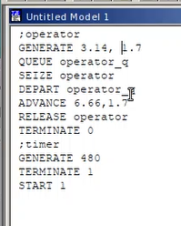{ #fig:pic3 width=100% }

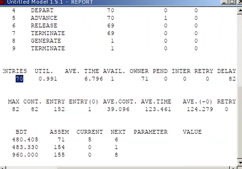{ #fig:pic4 width=100% }

Построение гистограммы(рис.[-@fig:pic5]), (рис.[-@fig:pic6]).

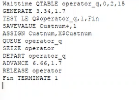{ #fig:pic5 width=100% }

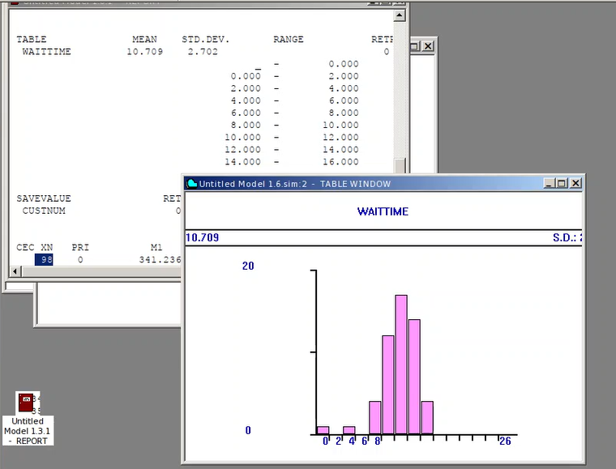{ #fig:pic6 width=100% }

В интернет-магазин к одному оператору поступают два типа заявок от клиентов —
обычный заказ и заказ с оформление дополнительного пакета услуг. Заявки первого
типа поступают каждые 15 ± 4 мин. Заявки второго типа — каждые 30 ± 8 мин.
Оператор обрабатывает заявки по принципу FIFO («первым пришел — первым
обслужился»). Время, затраченное на оформление обычного заказа, составляет 10 ±
2 мин, а на оформление дополнительного пакета услуг — 5 ± 2 мин. Требуется
разработать модель обработки заказов в течение 8 часов, обеспечив сбор данных об
очереди заявок от клиентов(рис.[-@fig:pic7]), (рис.[-@fig:pic8]).

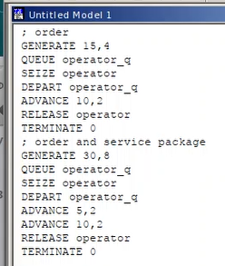{ #fig:pic7 width=100% }

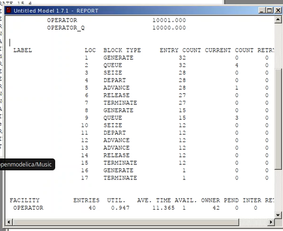{ #fig:pic8 width=100% }

Скорректируйте модель так, чтобы учитывалось условие, что число
заказов с дополнительным пакетом услуг составляет 30% от общего числа заказов.
Используйте оператор TRANSFER. Проанализируйте отчёт(рис.[-@fig:pic9]), (рис.[-@fig:pic10]).

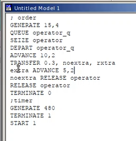{ #fig:pic9 width=100% }

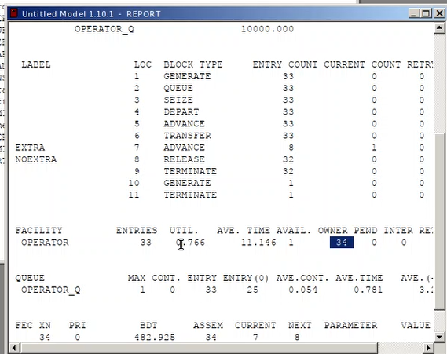{ #fig:pic10 width=100% }

В интернет-магазине заказы принимают 4 оператора. Интервалы поступления зака-
зов распределены равномерно с интервалом 5 ± 2 мин. Время оформления заказа
каждым оператором также распределено равномерно на интервале 10 ± 2 мин. Об-
работка поступивших заказов происходит в порядке очереди (FIFO). Требуется
определить характеристики очереди заявок на оформление заказов при условии, что
заявка может обрабатываться одним из 4-х операторов в течение восьмичасового
рабочего дня(рис.[-@fig:pic11]), (рис.[-@fig:pic12]).

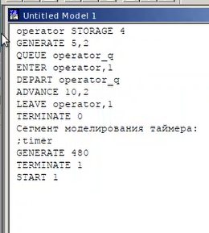{ #fig:pic11 width=100% }

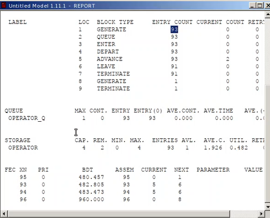{ #fig:pic12 width=100% }

Измените модель: требуется учесть в ней возможные отказы клиентов от заказа
— когда при подаче заявки на заказ клиент видит в очереди более двух других
заявок, он отказывается от подачи заявки, то есть отказывается от обслуживания
(используйте блок TEST и стандартный числовой атрибут Qj текущей длины
очереди j)(рис.[-@fig:pic13]), (рис.[-@fig:pic14]).

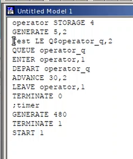{ #fig:pic13 width=100% }

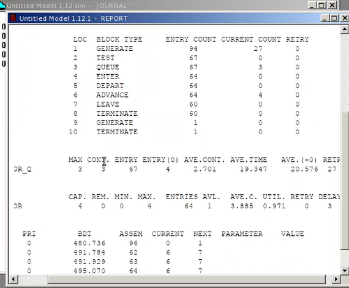{ #fig:pic14 width=100% }

# Выводы

Научилась работать с моделью обработки заказов.

# Список литературы{.unnumbered}

::: {#refs}
:::
