---
## Front matter
lang: ru-RU
title: Лабораторная работа №16
subtitle: Дисциплина - имитационное моделирование
author:
  - Пронякова О.М.
institute:
  - Российский университет дружбы народов, Москва, Россия
date: 03 апреля 2025

## i18n babel
babel-lang: russian
babel-otherlangs: english

## Formatting pdf
toc: false
toc-title: Содержание
slide_level: 2
aspectratio: 169
section-titles: true
theme: metropolis
header-includes:
 - \metroset{progressbar=frametitle,sectionpage=progressbar,numbering=fraction}
---

# Информация

## Докладчик

:::::::::::::: {.columns align=center}
::: {.column width="70%"}

  * Пронякова Ольга Максимовна
  * студент НКАбд-02-22
  * факультет физико-математических и естественных наук
  * Российский университет дружбы народов

:::
::::::::::::::

# Создание презентации

## Цель работы

Реализовать с помощью gpss модель двух стратегий обслуживания и оценить оптимальные параметры.

## Этапы выполнения работы

# Выполнение лабораторной работы

На пограничном контрольно-пропускном пункте транспорта имеются 2 пункта пропуска. Интервалы времени между поступлением автомобилей имеют экспоненциальное распределение со средним значением 𝜇. Время прохождения автомобилями пограничного контроля имеет равномерное распределение на интервале [𝑎, 𝑏]. Предлагается две стратегии обслуживания прибывающих автомобилей: 1) автомобили образуют две очереди и обслуживаются соответствующими пунктами пропуска; 2) автомобили образуют одну общую очередь и обслуживаются освободившимся пунктом пропуска. Исходные данные: 𝜇 = 1, 75 мин, 𝑎 = 1 мин, 𝑏 = 7 мин. 3.2 

## Этапы выполнения работы

Построение модели 
Целью моделирования является определение: 
• характеристик качества обслуживания автомобилей, в частности, средних длин очередей; среднего времени обслуживания автомобиля; среднего времени пребывания автомобиля на пункте пропуска; 
• наилучшей стратегии обслуживания автомобилей на пункте пограничного контроля;
• оптимального количества пропускных пунктов. В качестве критериев, используемых для сравнения стратегий обслуживания автомобилей, выберем: 
• коэффициенты загрузки системы; 
• максимальные и средние длины очередей; 
• средние значения времени ожидания обслуживания. Для первой стратегии обслуживания, когда прибывающие автомобили образуют две очереди и обслуживаются соответствующими пропускными пунктами, имеем следующую модель.
После запуска симуляции получим отчёт.
Составим модель для второй стратегии обслуживания, когда прибывающие автомобили образуют одну очередь и обслуживаются освободившимся пропускным пунктом (рис.[-@fig:pic1]), (рис.[-@fig:pic2]), (рис.[-@fig:pic3]), (рис.[-@fig:pic4]).

## Этапы выполнения работы

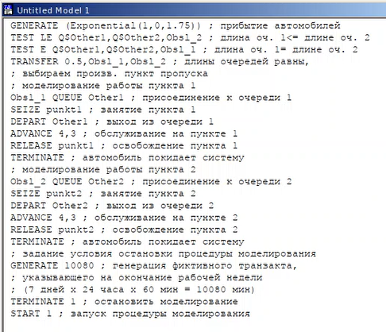{ #fig:pic1 width=100% }

## Этапы выполнения работы

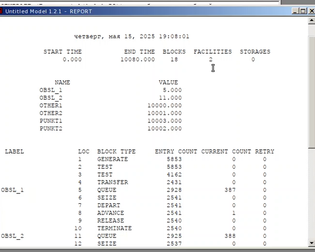{ #fig:pic2 width=100% }

## Этапы выполнения работы

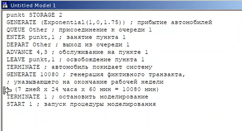{ #fig:pic3 width=100% }

## Этапы выполнения работы

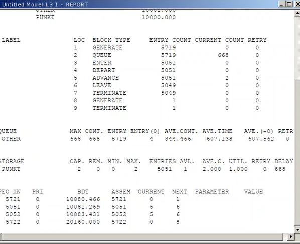{ #fig:pic4 width=100% }

## Этапы выполнения работы

Составим таблицу по полученной статистике (рис.[-@fig:pic5])

## Этапы выполнения работы

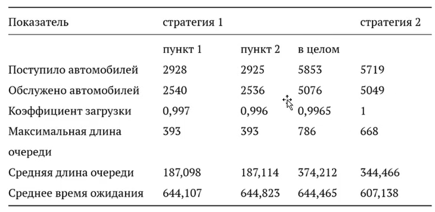{ #fig:pic5 width=100% }

## Этапы выполнения работы

Сравнив результаты моделирования двух систем, можно сделать вывод о том, что первая модель позволяет обслужить большее число автомобилей. Однако мы видим, что разница между обслуженными и поступившими автомобилями меньше для второй модели – значит, продуктивность работы выше. Также для второй модели коэффициент загрузки равен 1 – значит ни один из пунктов не простаивает. Максимальная длина очереди, средняя длина очереди и среднее время ожидания меньше для второй стратегии. Можно сделать вывод, что вторая стратегия лучше

## Этапы выполнения работы

Оптимизация модели двух стратегий обслуживания Изменим модели, чтобы определить оптимальное число пропускных пунктов (от 1 до 4). Будем подбирать под следующие критерии: • коэффициент загрузки пропускных пунктов принадлежит интервалу [0, 5; 0, 95]; • среднее число автомобилей, одновременно находящихся на контрольно пропускном пункте, не должно превышать 3; 
• среднее время ожидания обслуживания не должно превышать 4 мин. Для обеих стратегий модель с одним пунктом выглядит одинаково (рис.[-@fig:pic6]), (рис.[-@fig:pic7]).

## Этапы выполнения работы

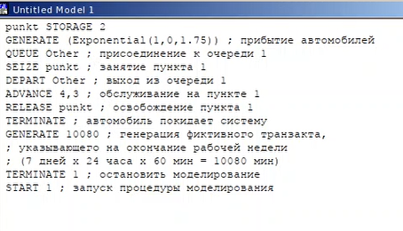{ #fig:pic6 width=100% }

## Этапы выполнения работы

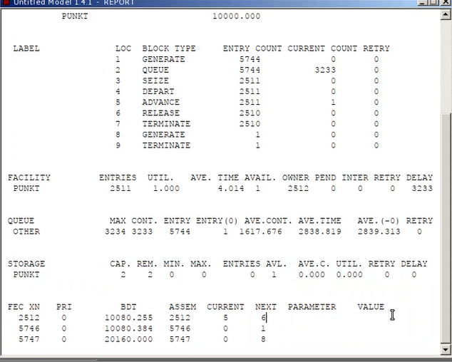{ #fig:pic7 width=100% } 

## Этапы выполнения работы

В этом случае модель не проходит ни по одному из критериев, так как коэффициент загрузки, размер очереди и среднее время ожидания больше. 
Построим модель для первой стратегии с 3 пропускными пунктами и получим отчет (рис.[-@fig:pic8]), (рис.[-@fig:pic9]).

## Этапы выполнения работы

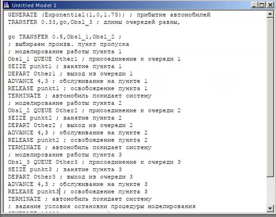{ #fig:pic8 width=100% }

## Этапы выполнения работы

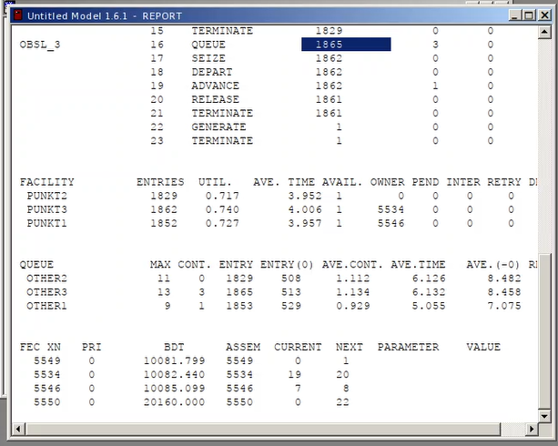{ #fig:pic9 width=100% }

## Этапы выполнения работы

В этом случае среднее количество автомобилей в очереди меньше 3 и коэффициент загрузки в нужном диапазоне, но среднее время ожидания больше 4. Построим модель для первой стратегии с 4 пропускными пунктами (рис.[-@fig:pic10]), (рис.[-@fig:pic11]).

## Этапы выполнения работы

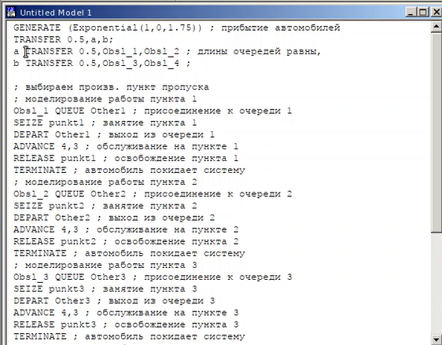{ #fig:pic10 width=100% }

## Этапы выполнения работы

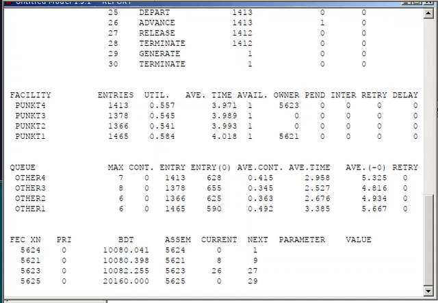{ #fig:pic11 width=100% }

## Этапы выполнения работы

В этом случае все критерии выполнены, поэтому 4 пункта являются оптимальным количеством для первой стратегии. Построим модель для второй стратегии с 3 пропускными пунктами и получим отчет (рис.[-@fig:pic12]), (рис.[-@fig:pic13]).

## Этапы выполнения работы

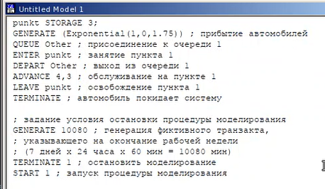{ #fig:pic12 width=100% }

## Этапы выполнения работы

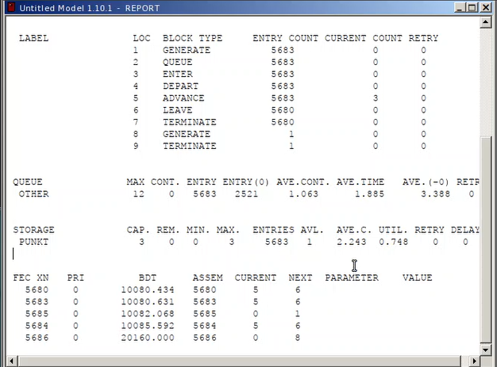{ #fig:pic13 width=100% }

## Этапы выполнения работы

В этом случае все критерии выполняются, поэтому модель оптимальна/  Построим модель для второй стратегии с 4 пропускными пунктами и получим отчет (рис.[-@fig:pic14]), (рис.[-@fig:pic15]).

## Этапы выполнения работы

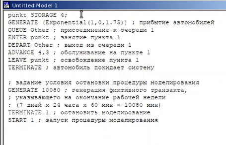{ #fig:pic14 width=100% }

## Этапы выполнения работы

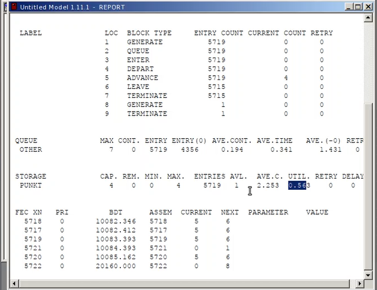{ #fig:pic15 width=100% } 

## Этапы выполнения работы

Здесь все критерии выполнены при этом время ожидания и среднее число автомобилей меньше, чем в случае второй стратегии с 3 пунктами, однако и загрузка  меньше. Можно сделать вывод, что 4 пропускной пункт излишне разгружает систему. В результате анализа наилучшим количеством пропускных пунктов будет 3 при втором типе обслуживания и 4 при первом. 

## Выводы

В результате выполнения данной лабораторной работы я реализовала с помощью gpss: 
• модель с двумя очередями; 
• модель с одной очередью; 
• изменить модели, чтобы определить оптимальное число пропускных пунктов. 

