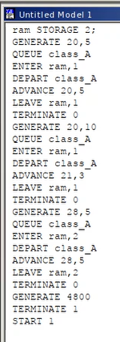
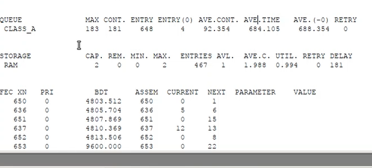
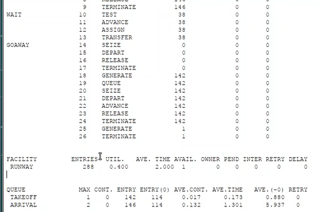
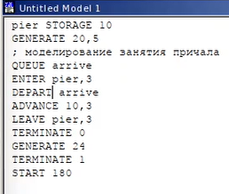
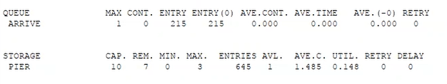
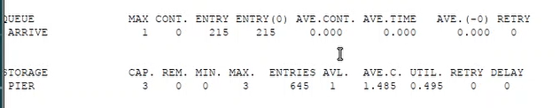
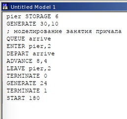
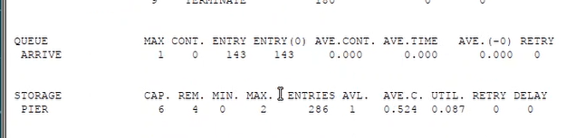
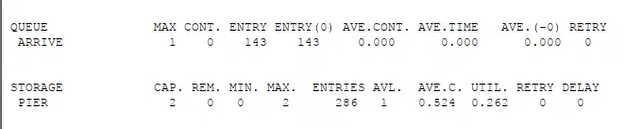

---
## Front matter
lang: ru-RU
title: Лабораторная работа №17
subtitle: Дисциплина - имитационное моделирование
author:
  - Пронякова О.М.
institute:
  - Российский университет дружбы народов, Москва, Россия
date: 03 апреля 2025

## i18n babel
babel-lang: russian
babel-otherlangs: english

## Formatting pdf
toc: false
toc-title: Содержание
slide_level: 2
aspectratio: 169
section-titles: true
theme: metropolis
header-includes:
 - \metroset{progressbar=frametitle,sectionpage=progressbar,numbering=fraction}
---

# Информация

## Докладчик

:::::::::::::: {.columns align=center}
::: {.column width="70%"}

  * Пронякова Ольга Максимовна
  * студент НКАбд-02-22
  * факультет физико-математических и естественных наук
  * Российский университет дружбы народов

:::
::::::::::::::

# Создание презентации

## Цель работы

Реализовать с помощью gpss модели работы вычислительного центра, аэропорта и морского порта.

## Этапы выполнения работы

Моделирование работы вычислительного центра 
На вычислительном центре в обработку принимаются три класса заданий А, В и С. Исходя из наличия оперативной памяти ЭВМ задания классов А и В могут решаться одновременно, а задания класса С монополизируют ЭВМ. Задачи класса С загружаются в ЭВМ, если она полностью свободна. Задачи классов А и В могут дозагружаться к решающей задаче. Смоделируем работу ЭВМ за 80 ч. и определим её загрузку. Построим модель.  Задается хранилище ram на две заявки. Затем записаны три блока: первые два обрабатывают задания класса A и B, используя один элемент ram, а третий обрабатывает задания класса C, используя два элемента ram. Также есть блок  времени генерирующий 4800 минут (80 часов).  Из отчета увидим, что загруженность системы равна 0.994.(рис.1), (рис.2).

## Этапы выполнения работы

{ #fig:pic1 width=100% }=100%}

## Этапы выполнения работы

{ #fig:pic2 width=100% }=100%}

## Этапы выполнения работы

Модель работы аэропорта Самолёты прибывают для посадки в район аэропорта каждые 10 ± 5 мин. Если взлетно-посадочная полоса свободна, прибывший самолёт получает разрешение на посадку. Если полоса занята, самолет выполняет полет по кругу и возвращается в аэропорт каждые 5 мин. Если после пятого круга самолет не получает разрешения на посадку, он отправляется на запасной аэродром. В аэропорту через каждые 10 ± 2 мин к взлетно -посадочной полосе выруливают готовые к взлёту самолёты и получают разрешение на взлёт, если полоса свободна. Для взлета и посадки самолёты занимают полосу ровно на 2 мин. Если при свободной полосе одновременно один самолёт прибывает для посадки, а другой – для взлёта, то полоса предоставляется взлетающей машине. Требуется: 
• выполнить моделирование работы аэропорта в течение суток; 
• подсчитать количество самолётов, которые взлетели, сели и были направлены на запасной аэродром; 
• определить коэффициент загрузки взлетно-посадочной полосы. 

## Этапы выполнения работы

Построим модель.  Блок для влетающих самолетов имеет приоритет 2, для прилетающий приоритет 1 (чем выше значение, тем выше приоритет). Происходит проверка: если полоса пустая, то заявка просто отрабатывается, если нет, то происходит переход в блок ожидания. При ожидании заявка проходит в цикле 5 раз, каждый раз проверяется не освободилась ли полоса, если освободилась – переход в блок обработки, если нет – самолет обрабатывается дополнительным обработчиком отправления в запасной аэродром. Время задаем в минутах – 1440 (24 часа). После запуска симуляции получаем отчёт(рис.3), (рис.4).

## Этапы выполнения работы

{ #fig:pic3 width=100% }=100%}

## Этапы выполнения работы

{ #fig:pic4 width=100% }=100%}

## Этапы выполнения работы

 Взлетело 142 самолета, село 146, а в запасной аэропорт отправилось 0. В запасной аэропорт не отправились самолеты, поскольку процессы обработки длятся всего 2 минуты, что намного быстрее, чем генерации новых самолетов. Коэффициент загрузки полосы равняется 0.4, полоса большую часть времени не используется. 
Моделирование работы морского порта Морские суда прибывают в порт каждые  часов. В порту имеется N причалов. Каждый корабль по длине занимает M причалов и находится в порту  часов. Требуется построить GPSS-модель для анализа работы морского порта в течение полугода, определить оптимальное количество причалов для эффективной работы порта. Рассмотрим два варианта исходных данных.  Построим модель для первого варианта(рис.5), (рис.6).

## Этапы выполнения работы

{ #fig:pic5 width=100% }=100%}

## Этапы выполнения работы

{ #fig:pic6 width=100% }=100%}

## Этапы выполнения работы

При запуске с 10 причалами видно, что судна обрабатываются быстрее, чем успевают приходить новые, так как очередь не набирается. Кроме того загруженность причалов очень низкая.Соответственно, установив наименьшее возможное число причалов – 3, получаем оптимальный результат, что видно на отчете(рис.7).

## Этапы выполнения работы

{ #fig:pic7 width=100% }=100%}

## Этапы выполнения работы

Построим модель для второго варианта(рис.8), (рис.9).

## Этапы выполнения работы

{ #fig:pic8 width=100% }=100%}

## Этапы выполнения работы

{ #fig:pic9 width=100% }=100%}

## Этапы выполнения работы

При запуске с 6 причалами видно, что судна обрабатываются быстрее, чем успевают приходить новые, так как очередь не набирается. Кроме того загруженность причалов очень низкая. Соответственно, установив наименьшее возможное число причалов – 2, получаем оптимальный результат, что видно из отчета(рис.10).

## Этапы выполнения работы

{ #fig:pic10 width=100% }=100%}

## Выводы

В результате выполнения данной лабораторной работы я реализовала с помощью gpss: 
• модель работы вычислительного центра; 
• модель работы аэропорта; 
• модель работы морского порта. 
:::

